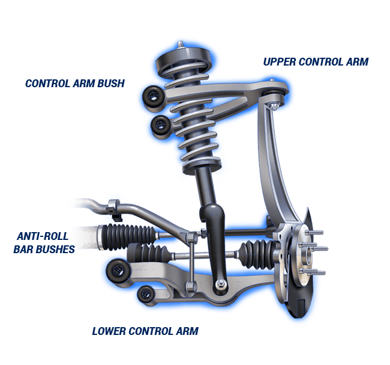

+++
title = "Autocross 2023"
date = 2024-07-12T19:32:33-05:00
draft = false

[taxonomies]
tags = ["wrenching", "miata"]
+++

# Autocross 

Last season I raced the Miata, twice! I had a lot of fun and learned a great deal.

If Formula 1 racing is the top rung of motorsports, autocross is probably at the bottom. Autocross is generally hosted in a parking lot and the track is defined by cones. The format of the "race" is a time trial, one car is sent out at a time and the fastest time wins. You receive a time penalty for each cone you hit. 

Autocross is one of the most accessible forms of racing. You can show up with just about any car, and compete against people in similar cars. The course setup and generally low overall speed minimize the chance of property damage.

This event is hosted by BMW CCA, and the classifications, as a result, are amusing: all non-BMW cars are in the same class. As a result, our Miata is in the same class as this open-wheel racecar: 

Nor does the Miata qualify for any points, but about 50% of the cars there weren't BMWs, because racing cars is fun as hell.

I did two sessions to understand how our bone stock car stacks up. In Autocross the most competitive mods are generally great tires and suspension. The Miata does come with a reasonably competitive suspension from the factory. The suspension design: a double wishbone suspension is generally something you find on high-end sports cars. 

So that's good, but our suspension is 27 years old, and if you look closely much of the rubber boot is frayed:
 

There are other pretty "tired" components like our bushings that are likely holding us back as well. 

The tires we're running are also possibly the worst tires for this setting. They're all-weather hard-compound tires that are pretty practical for life as a daily car. But it is very impractical for racing cars around a parking lot (a very practical activity).

 

But nonetheless, Autocross is a very welcoming environment so I gave it a shot. 

This event is particularly lax in the way that they don't require convertibles to install a roll cage. Tech-inspection is primarily an individual responsibility which is genuinely rare in motorsports. With the setup of this event, I also got to bring a buddy who could drive the Miata without reducing any of my seat time. For the first session, I brought my Dad who very quickly discovered that racing seats are uncomfortable. And the second time I brought my best friend [Travis](https://www.instagram.com/portraitsbytrav/) who took a handful of these photos. 

Quickly after arriving you realize that not only will you be driving your car, but you'll also be a volunteer for running the event. Volunteers run out onto the course to fix downed cones and report when cars go off track. It's not always clear where the cone goes...

Even at low speeds the process of trying to improve your time lap after lap is quite fun. It rapidly becomes an exercise in memory, if you're thinking about where to go you're probably not doing as well as you could. Hesitation at the limit of traction probably means you're going to hit a cone or go off track. A few cones were destroyed by me: 

Between the first and second sessions, I installed a bunch of telemetry in the car, to better understand how I'm doing, but also give me some time between sessions to try to remember the track better:

**TODO VIDEO**

After the event concludes race results are released: https://www.njbmwcca.org/event_info/results/autox_20231008_fin.htm. During our second, we completed 47th overall with 60 total contestants. And within our (relatively meaningless) class we were 30th out of 37th.

It's fascinating to see how all these cars stack up, and something I found particularly inspiring is that the value of our car is probably one of the lowest in the event overall, and the [first session](https://www.njbmwcca.org/event_info/results/autox_20230917_fin.htm) was won overall by a Miata.

It was also fascinating to see the incredible variety of cars at the event:

There were some dedicated, prepped, exotic track cars: 

Some expensive cars:

Some unsuspecting stuff:

And some adorable stuff: 

Overall I had a blast and I look forward to bringing more of my buddies to this eclectic weekend event, building the car, and building my skills up.

What's next for the car, is as expected: fresh tires, and fresh suspension. Before the next event, this is what we'll be taking care of.