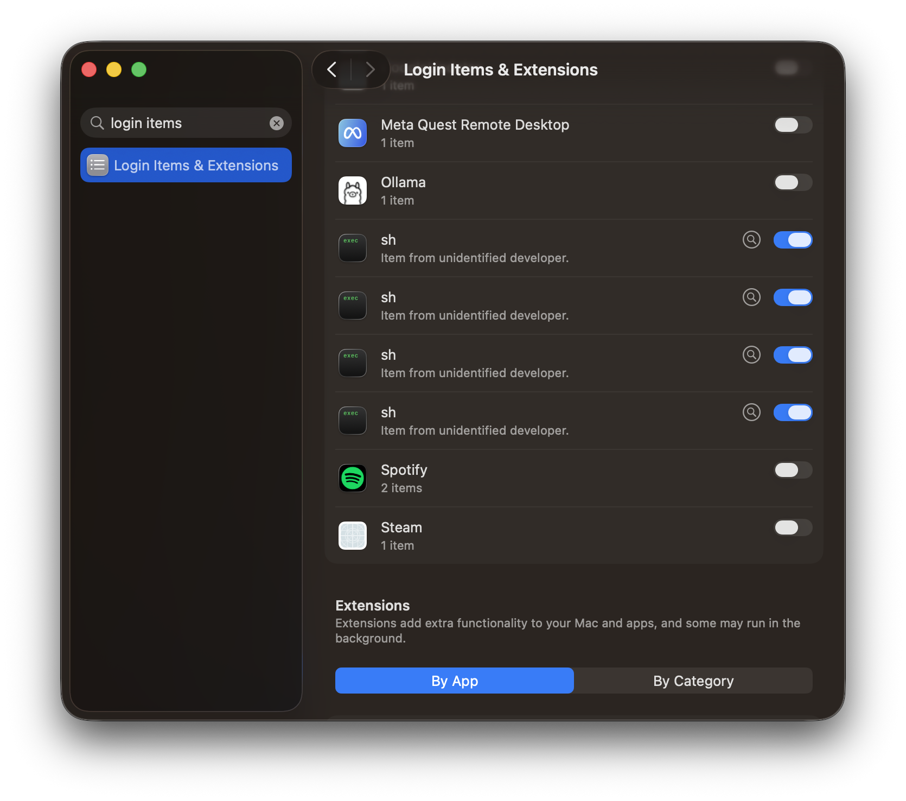
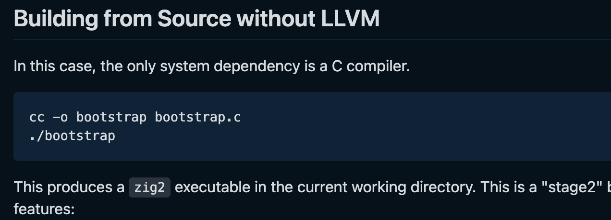

# The struggle of shipping

For a lot of software engineers, *deployment* looks like one of the following:
* yeet some web code onto a CDN
* yeet some backend code onto servers that you control

This is a relatively solved problem with minimal tooling required. If this isn't a smooth process for you, it is a skill issue. This post is not going to be about shipping that kind of software.

We're going to be taking a look at what's involved in shipping software to some real humans with some real devices, and the suffering involved.

Let's suppose you want to write a graphical app: you pick the UI framework/language pair you know best, roll up your sleeves and dive in. It starts to take shape, you hit up your best friend, also a programmer -- hey, try my app. I'd say there's a 50% chance he already has your toolchain set up (guess it depends how good a friend he really is).

Let's say he doesn't have the toolchain set up; maybe you're using modern tooling, which makes this a good time: he can just `brew install go`, right? But then there's probably something he has to add to his `$PATH`. That's a bit to ask (depends how good a friend he is). Also maybe he's on Arch, so maybe you'll have specific instructions for each of your friends depending on what environment they're on (and how based they are). This seems like a lot.

Is this the problem something like *Docker* is trying to solve? I could include a Dockerfile that would build the app reliably, right? Wrong. Docker fails in this world pretty quickly:
* I can't run a *graphical* app from Docker.
* I can't emulate Windows from Docker.
* Docker is not minimally invasive on my machine.
  * Docker on macOS is resource intensive.
  * Docker on Linux requires bespoke configuration, and fiddling with user permissions.

And lastly, the point I want to dive deeper into is: Docker is a conceptually heavy tool, and it doesn't displace an existing tool in my toolkit. If I'm in the *Rust* world, *Docker* doesn't displace *cargo*, and it requires some specific suffering to be viable as a local development tool. On my machine it similarly won't displace my *package manager*. These are all tools solving pretty similar problems: fetch a specific version of software, take some action on it.

Okay, so let's rewind a bit: maybe setting up a dev machine can offload some complexity to programmers. Maybe it's fine for my README to say *go get the Rust toolchain*, and if the person can't figure out how to do that they can fuck off. I mean, my target demographic doesn't need to cross this filter, right? What I need to do is *ship a binary* to a human, like my mom. For my mom, *docker*, *cargo*, *nix*, *$PATH* are nonsense concepts.

Well, what happened to just shipping some good 'ole binaries to people? If everyone's on the same platform *maybe* this will work out nicely, but likely you need to support *at least* 2 platforms. Have you tried to cross compile something recently? Your experience will likely fall into one of the following categories:
* **You're a Soydev:** you're writing something that expects to run on a *runtime*. Think *javascript*, *python*, *java*. You (optionally) compile to some intermediate representation that a program already present on the user's system knows how to handle. You hope that runtime is available, but likely you can't depend on that -- macOS used to ship with `java` and `python` and no longer does. Are you old enough to remember when Flash & ActionScript were a thing? You can do a song and dance with a package manager to *ensure* they're available, but now we're back to the **N Package Managers** problem. Or you can do the spiritual equivalent of static linking and ship an enormous binary to your users. Maybe this is fine, your program is already incredibly wasteful with regards to CPU, RAM, what's the harm in making it wasteful end to end?
* **Your programming language left this as an exercise for you to solve:** Languages like Swift don't really attempt to solve this problem. Most languages can compile down to an intermediate representation that LLVM understands, and then LLVM will take it from there. But to do anything useful generally (**surprise**) you need to depend on a mountain of C code and platform-specific tooling. The maturity and based-ness of your toolchain will determine how much work this will take on your part. Swift & Rust fall into this camp.
* **Your programming language is based:** Go sidestepped a number of problems by designing their own linker, and on Linux they sidestepped libc by implementing their own and interacting directly with syscalls. As a result, so long as you're doing something relatively well defined (compiling for your Linux server from your Mac) you'll have a good time. The toolchain doesn't attempt to solve problems for more obscure architectures and scenarios. And it makes pragmatic tradeoffs with regards to libc -- for instance on macOS, Windows, and some BSDs it will still expect to dynamically link against a system-provided libc. And those platforms tend to be more homogeneous, so this is fine. **Zig** takes this further: like **Golang** they built their own linker, but in addition to being able to compile Zig source code, the Zig compiler can also compile C & C++. This has massive implications for build tooling that we will explore shortly.
* **You are based:** you stayed disciplined; while others were experimenting with types and drugs, you managed your memory manually. As a result you know how to vendor your dependencies, invoke different compilers, and link in different platform code. You'll probably have a fine time bringing your code mostly anywhere.

It seems like one of the key things that will determine your experience is how your programming language handles C. Our discussion so far is mostly centered around how your programming language's standard library handles these concepts. In my time working mostly on Rust & Go, I've come to appreciate how often this is not possible.

Certain high performance concepts are hard to express in a garbage collected language like Go. At least with Rust, most ideas are expressible and most performance profiles are achievable. Progress has been made in some domains, but C/C++ still has the most competitive / scrutinized / trustworthy implementations of (in order of my personal familiarity):
* Cryptography, specifically the dominance of `libssl`. We use `Rustls`.
* PDF rendering: `pdfium` by Google seems to be the best; only recently were we able to switch to `Hayro`.
* Ancillary tasks associated with making a GUI: `xkbcommon-dl` for instance.
* Encoding/decoding of audio and video: `ffmpeg`; so far we've found no alternative.
* HEIC support
* Web rendering
* Document conversions (think Pandoc, not C but also not Rust)
* Machine learning inference

When you reach for one of these more advanced libraries, at least within Rust, there are a couple of outcomes you could have:
* Best case scenario: they've implemented everything right, and they depend on a small, easy-to-build C library. Cargo is actually able to *compile this C code on the spot* using the `cc` crate. `OpenSSL` does this great: https://docs.rs/openssl/latest/openssl/#vendored
* Usually: there's a build-time dependency that is only resolvable on the host platform. This could be due to requiring `-dev` packages that contain headers, or it could just be because the build process implicitly depends on `pkg-config` or something like that. At least in this universe, generally speaking, things are still being statically linked.
* Worst case scenario (not uncommon): there's additionally a runtime (dynamic) dependency on something that you cannot assume will be present on a user's system (or the user's system is hostile to implicit dependencies). Now you're back to the **N Package Managers** problem. Generally this problem only manifests itself on Linux.

So if you're lucky you'll be in a situation where you can cross compile reliably, or you can leverage something like a build matrix on GitHub Actions to produce binaries for a bunch of platforms. This will probably be fine for your friend (depends on how based they are); they can probably download a binary, stick it in a path, and make it executable, but your mom still cannot do those things. Generally speaking, you *cannot just* download a binary and run it.

Your binary will need things associated with it that make it executable, give it a nice icon. Even if you're just shipping a CLI and it's never going to reach your mom, do you really want to ship a binary without completions? Unfortunately all of these things bring us back to the **N Package Managers** problem (the app store is a package manager too). Maybe we have some tools to sidestep the [**N Shells Problem**](../lb/creating-a-sick-cli.md).

But probably you're like me, and you're not lucky, and you're also not willing to tolerate the general state of things. You're willing to be radical, at least with the tools you depend on. So let's frame the problem slightly differently:

I'll accept the **N Package Managers** problem if I can describe as much of my program as possible in something portable. If adding support for a platform is as simple as: "Here is my binary, here is my icon, some completions, I have no dependencies." If I can do this it vastly reduces the amount of work I have to put in per distribution channel.

"Bro just discovered static linking?" Have you ever tried to actually statically link something so it will work in any environment? Check out this 8-part blog post on simply attempting to create a statically linked pipeline that converts PDFs to SVGs: https://fasterthanli.me/series/dont-shell-out/part-1. The author of this article had to migrate an upstream dependency to a different build system and patch problems in several build systems. I do recommend reading through and exploring these concepts.

Solving this problem excellently has massive upside for me. For Lockbook, I would be able to package more experiences into the application itself. Solving this problem would also give me the ability to describe *environments*: dev environments, production environments, build environments, etc. This is obviously a valuable problem that lots of people have worked on, so let's take a look at a dramatically different Docker competitor: Nix.

# The Nix Approach
Nix lets you describe a program's dependencies in *Nix* (the programming language), declaratively. *Nix* (the package manager) can interpret this file, look at the state of your system, and reconcile the differences. This ability is so powerful that you can use it to describe a whole operating system; this operating system is also called *Nix*.

I've used Nix for 2 years, and before that I used Arch Linux (for 10 years? Goddamn). Nix indeed is as powerful as it sounds; these hypothetical gains were backed up by my ability to take the whole "terminal portion" of my computing experience, describe it in source, and share it between NixOS and macOS. My terminal development environment is non-trivial. These days 95% of my work happens between `fish` & `neovim`, and not only was Nix able to reproduce this between the two environments, it was also able to replace a `neovim` package manager by having Nix fetch my packages.

Another thing I appreciate is the ability to define the config and behavior of programs in a unified language. This helps tame all the random config files that go into setting up a Linux machine. All the various `.conf` files in `/etc`, my `git` config -- they're all in an actual programming language which a compiler is checking for mistakes, suggesting ways for me to evolve as packages are upgraded.

However, not all is sunshine and rainbows. Installing *NixDarwin* (Nix on macOS) was pretty invasive, and continues to be a little strange: . These 4 unlabeled startup actions look like I was penetrated by agents of the deep state. I'm fairly sure they're from Nix, because my dev setup immediately ceases to function if I remove them.

Nix just doesn't integrate that deeply with macOS, and has a significantly smaller presence on Windows. To get things to work smoothly you pretty much need Nix to manage Homebrew. There is some part of my setup managed by Nix, that is managing Homebrew, which is managing installing apps from the App Store.

*Nix* itself as a language just isn't that useful to me. 2 years later, I've created a dev env for Lockbook work, our CI machine uses Nix, I maintain multiple Nix packages, and I don't really understand why they needed to make their own language. Could they really not have used something like `lisp` for their purposes? Is it unreasonable to think the project would be farther along with the free support from the Lisp and Emacs people? I'm not deep enough in the weeds to be able to answer that question.

Because it's so heavy I can't really impose it on my team; I can't tell Adam, for instance, to just "whip up a quick nix config" for Android development. And if I bring in audio transcription support and the build process requires Nix, I don't think that's a tool I can impose on everyone who wants to build from source. Sure, I can make the dependency optional, but all that's beside the point.

And so I'm left wanting a bit more from the tool that's going to occupy this spot in my toolbox. I'm happy with the load it's bearing for now, but I have motivations to research alternative ways of thinking about this problem.

# The Rust Approach
I've mentioned in a few places how I like to keep my toolkit small. So if my programming language can solve a particular problem, I'll reach for that first before I reach for other things ([like sql](../lb/db-rs.md)).

I touched on how Nix allows you to do config in an actual programming language. Also worth talking about in this domain are the products made by Suckless.

The Suckless folk impose tight simplicity constraints on the tools they produce, and the customization surface area of a tool like a tiling window manager is really large. How do they reconcile that complexity? Simple: you edit the well thought out C source files directly. Config as a result is about as easy to tweak as a `.conf` file, but now you have a compiler checking that the values are sane.

In the world of ricing this is not too uncommon: `XMonad` is a tiling window manager which is configured in Haskell. Neovim and Wezterm use Lua for configuration.

So what does using `Rust` to solve some of my problems look like? Well, I took some of the first steps towards that in the form of `lbdev`. This is the command line tool where we encode all of our build knowledge: from including Rust UIs in our SwiftUI app, to our release automation, our continuous integration, everything.

At a company I worked at for 4 years (named MadHive), I similarly authored the `mad` CLI in Golang, replacing a pretty hairy mountain of `Makefiles`, shell scripts, and Python.

I would consider these experiences successes in the sense that they provided us a lot of valueand  productivity, and empowered almost everyone on the team to understand what's going on, make modifications, add new services, etc.

But they weren't responsible for fetching dependencies; that was still outsourced to `Docker` at MadHive (along with bespoke install instructions depending on the team). And at `Lockbook`, similarly, there's just a bunch of manual steps you have to do if you want to set up an environment for Android, iOS, or Linux development. There are many situations in both environments where `cargo run` or `go run` *just works*, but there are areas where only certain personas can do basic tasks (throw the latest build on a simulator).

And so what does doing it the Rust way look like? I don't need Rust to go set up the Android SDK and NDK, and Rust *can* invoke the C compiler, but only for your platform. But to make libraries behave themselves, vendor the source code, and statically link (think PDF libs, not libc), you're usually going to have to dive deep into some `ninja`, `meson`, `cmake`, `make`, `autotools` and figure out the tooling and linking story yourself. Or you can just re-write it in pure Rust, bonus points if the problem can be `no-std`.

Once you get a good grasp of the situation, do you have some good tools to help you build these dependencies? Can you convert these other ideas back into Rust ideas and maintain the build system yourself in your native language? Not really. Rust does have a `build.rs` where you can execute arbitrary code. But there's no nice "set up a build graph", "point at an abstract notion of a compiler which will be substituted for the right one based on build flags". This is an example of how you instruct the tooling to statically link something. You print strings out...

```rust
// in `pdftocairo/build.rs`

fn main() {
    // poppler-glib requires poppler
    println!("cargo:rustc-link-lib=static=poppler");
    // poppler is written in C++
    println!("cargo:rustc-link-lib=static=stdc++");
    // nobody bothers including this in their pkg-config files apparently
    println!("cargo:rustc-link-lib=static=png");
    // cairo needs this
    println!("cargo:rustc-link-lib=static=freetype");
    // cairo/freetype need this?
    // the freetype ChangeLog says the dependency graph looks like:
    // cairo => fontconfig => freetype2 => harfbuzz => cairo
    println!("cargo:rustc-link-lib=static=fontconfig");
    // cairo also needs this
    println!("cargo:rustc-link-lib=static=pixman-1");
    // fontconfig needs this (it's an XML parser)
    println!("cargo:rustc-link-lib=expat");
}
```

But realistically I have been able to express mostly anything I've ever wanted to, and if I'm considering something like writing a build system myself, then maybe I can just vastly improve the current norms around `build.rs`. Maybe I can create a build tool for building C which emphasizes certain values, but mostly makes it easy for a system like `Rust` or `Swift` or a package manager to quickly get answers to certain questions and generate certain files, and I could give the community ecosystem a good time.

I think this is what I will fall back to if I can't find a more pragmatic path forward. There are two variations of this path, and I'm pretty sure no one is doing something like this. There's a C variant and a Rust variant.

The C variant would be called `cbt`. Define a build tool in which devs author a `build.c`. All that's needed to evaluate this tool is `gcc`, perhaps one of the only things you can take for granted in this world. Devs will express what their dependencies are in something like this (treat as vibes):  

```C
cbt_pkg *app = cbt_executable(p, (cbt_exe_spec) {
        .name = "myapp",
        .srcs = cbt_files(
            "main.c",
            "cli.c",
            "config.c"
        ),
        .deps = cbt_deps(
            libfoo
        ),
        .cflags = cbt_flags(
            "-Wall",
            "-Wextra",
            "-O2"
        ),
        .ldflags = cbt_flags(
            "-lfoo"
        ),
    });
```

Maybe you have to go download a `.h` file from somewhere, and that's your completely portable build system that's super easy to download. You just need a way to do something like `curl`.

Rust & C are already great friends, so Rust could just invoke these functions itself and call `cc`, or perhaps this library just solves enough of the problem where that's not needed. I think lots of people would benefit if such a tool existed. Its uptake could be very seamless (`curl -o cbt.h` to install literally anywhere), describing the build in a way that's accessible to any programming language.

The Rust variant of this is just smaller in scope, and is a potentially more reasonable proposition. And that's to just take an idea like encoding, create a high-level crate that expresses the ideas the Rust way, performs optimally, and handles the vendoring itself, internally, transparently, fundamentally, and excellently. For me this is viable because it benefits Lockbook, which will hopefully make this literal strategy profitable for, well, at least me, my customers, and the Rust community. I think this is also a viable path forward for me.

The only thing giving me pause with regards to either of these approaches is seeing if I come across a more pragmatic path towards the same ends. Which is literally just reliable static linking. I've been thinking about this problem since I started making a game in Golang during college (I started messing around with WebRTC back then, the only way to get UDP-like business in the browser). And I only found out about Nix a couple years back. So maybe someone will solve a greater portion of this problem for me and I can focus on bringing secure notes to more people.

And then I stumbled upon the fact that the *Neovim (C Project)* source tree has had a [`build.zig`](https://github.com/neovim/neovim/blob/master/build.zig) sitting in its project root.

# The Zig approach

```zig
    // neovim/build.zig
    ...
    const lpeg = if (sys_opts.lpeg) null else b.lazyDependency("lpeg", .{});

    const iconv = if (is_windows or is_darwin) b.lazyDependency("libiconv", .{
        .target = target,
        .optimize = optimize,
    }) else null;

    const utf8proc = if (sys_opts.utf8proc) null else b.lazyDependency("utf8proc", .{
        .target = target,
        .optimize = optimize,
    });

    const unibilium = if (use_unibilium and !sys_opts.unibilium) b.lazyDependency("unibilium", .{
        .target = target,
        .optimize = optimize,
    }) else null;
    ...
```

This is where the power of Zig being a shadow toolchain hit me. If Rust & C are good friends, Zig & C are best friends. Because the Zig binary itself is a compiler of C, they can just vendor any libc implementation for any platform and just build it. They don't need to ship `n*m` compilers for every host -> every other platform; they can genuinely build from any platform to any platform.

Okay, so they can build some C code, but do they actually help with the problem of getting dependencies, describing a build graph, and only re-executing the things that have changed? Or do they just give you a `build.rs` and say glhf?

I mean, I haven't tried it yet, but it looks like they do. Looks like they give you the following:

You write code that looks like this:

```zig
const std = @import("std");

pub fn build(b: *std.Build) void {
    const exe = b.addExecutable(.{
        .name = "hello",
        .root_module = b.createModule(.{
            .root_source_file = b.path("hello.zig"),
            .target = b.graph.host,
        }),
    });

    b.installArtifact(exe);
}
```

and you're setting up a declarative graph that the Zig build system evaluates :white_check_mark:. To me this looks like an actual programming language (although I've never written any Zig) :white_check_mark:. You don't do any `Cargo.toml` business; instead, hashes (the only supply chain security that I think needs to be at this layer) are stored in *Zig Object Notation*, which is a **subset of Zig**, which means the compiler is the only thing needed to evaluate it :white_check_mark:.

These are all pretty positive signals for me.

Zig also doesn't stand up centralized infrastructure like crates.io. I was willing to abuse crates for my needs if it came to it, but the Rust Foundation has also been aggressive towards people who stick "rs" in the names of their crates, and I do that quite a bit. But this centralized infrastructure is not necessarily a good place to store binary assets, if that's what a particular uncooperative build requires (though that starts to diminish the value of this idea anyways).

But let's actually test this: can I just literally clone the Neovim project and just build it? Yeah, I was literally able to do that. It seems that LuaJIT, treesitter, and a few other things I may actually want were feature flagged off. But I see their presence in the `build.zig`, so maybe I just have to learn what's up.

Okay, another test: if these people can truly manage the C compiler like this, and Zig is a C compiler, could I swap it out for `cc` in the Rust world? Holy shit, I can: https://github.com/rust-cross/cargo-zigbuild. So does Zig give Rust the ability to cross compile? I generally can't just cross compile without something like `cargo-cross`, which uses Docker under the hood :vomiting_face:.

But I'll be damned, `cargo zigbuild --target aarch64-unknown-linux-gnu.2.17` does indeed *just work* on my Mac for some of our crates. For the first time, without Docker!

Zig was a super light binary to get, and their README is saying all the right words:


So even if I describe an environment, a system, a dev tool, a library in a `build.zig`, and all I have is the C compiler, I still require no bespoke binaries for any particular platform to get off the ground. The other good vibe I'm getting from the binary is that the `Zig` toolchain is just a single binary. With `rust`, you need `rustup` to install the toolchain to a directory in which `Cargo` lives, and `Cargo` will invoke `rustc` and your linker and all that. All these tools need to be able to find one another. If I did need `Zig` to build, for example, `ffmpeg` to give us video playback support, I think describing "get this single tool" in a `build.rs`, or in `lbdev` for my team, is really no problem.

Okay, so I'll have to actually mess around with this; maybe in my next round of dotfiles investments I will try to swap out Nix for Zig. And what an exciting prospect that would be: Zig seems so much more useful a tool to learn deeply than Nix. The two things I know about the language also seem intriguing:
- the language is fundamentally simple, and is in the same performance bracket as C & Rust
- the metaprogramming story is -- you write Zig at compile time. I do love the idea that anything that looks like it could be solved by a programming-language-shaped tool is solved specifically by Zig, no matter what corner of the project you look in.

I've done a lot of metaprogramming in Rust within `db-rs` and `cli-rs` using significant amounts of `#[proc]` and `decl!` macros. I'm curious what the Zig flavor of all this is.

I had similar excitement about Nix originally. I would say Nix did make good on its promises. We'll have to see if Zig can bear that same load and more. If it can't, we'll fall back to a C or Rust flavored strategy.
