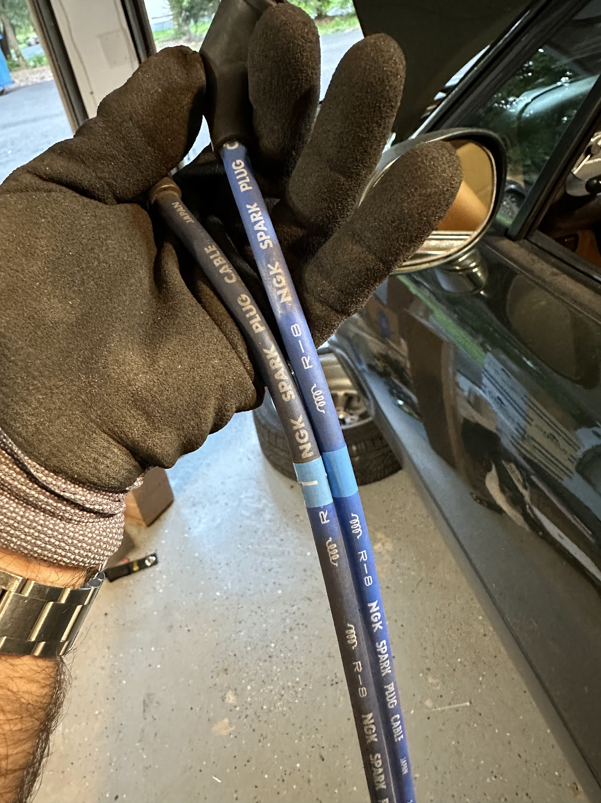

# Taking Stock of Our Purchase

As a recap, I picked up [this '97 Miata](https://miata.blog/p/buying-a-future-racecar) a couple of weeks ago. 

Now that it's in the garage, it's time to take stock of our new toy. So the car has 113,000 miles at the moment. In the [manual](https://drive.google.com/file/d/1vjZpyV1zeEFUu4qoI6h1cEsjmuDqNzG4/view?usp=sharing), the largest maintainence interval is 60k miles, which means anything that I'm not absolutely sure was done, needs to be done now. So what do we know about this car so far?

I mentioned I was pleased with the vehicle history report. To summarize, it said:
+ The car has had about 4 prior owners
+ It's been owned by people who serviced it at dealerships throughout its life. This means it's bone stock, and pretty well maintained. I'm surprised about the couple of items I don't see on this list, but we'll get into that later.
+ Apart from the oil changes and various checking of parts, the carfax report shows the following items have been replaced:
	+ water pump
	+ radiator hoses
	+ camshaft position sensor
	+ distributor seal
	+ clutch slave cylinder
	+ radiator clamps
	+ thermostat, housing, and gasket

Nothing alarming there. Among other things, absent from this history report are transmission and differential fluid change. That's pretty easy on these cars, there's a fill bolt and a drain bolt. The fill bolt is at a location that constrains the maximum amount of fluid, so you drain the old fluid and pump in the new fluid until you see it overflow.
 

 

Also absent from the history is any record of spark plugs being replaced. Easy enough:

 

These were way past due, you shouldn't be able to tell the gap difference with the naked eye. Also replaced the plug wires while I was at it, kinda cool to see a company make the same product for over 30 years.

 

While I had the car jacked up, I saw that one of my fender liners was held up by thoughts and prayers:

Removing the fender liner revealed the fasteners underneath, this car was repainted at some point, possibly the shop that did it kept these down here to not lose track of where they came from. Good effort. Now only a handful are missing and are on the way from Amazon.

It took me a while to track down an annoying squeak: turns out it was coming from the hood latch.

I tried greasing it which helped for a small amount of time. There is some play in the mechanism you use to unlatch the hood but I don't immediately see how I could adjust it without adding washers. Perhaps the problem is how much the chassis flexes in general. I plan to stiffen the car a few different ways, including shock tower bracing that looks something like this.

This sort of bracing is OEM in some Miatas, but not this one. For now, I'm just going to make my hood latch not be metal by wrapping it in some electrical duct tape. It's not great, but I have bigger fish to fry.

Speaking of annoying noises, there was a rusty metal rattling coming from the exhaust, and I didn't need too much of an excuse to replace the exhaust of a vehicle. I opted for a higher-end Borla cat-back exhaust.

I struggled tremendously to get the original oxygen sensor out. I used 3/4 of the techniques in my arsenal. I started by hitting it with some penetrating fluid. Upgrading to a "cheater bar". I even tried dremelling out the old threads to create a slight relief channel. I stopped short of using MAP gas to heat the threads because I couldn't find my blow torch. Ultimately I just the wire on the old oxygen sensor and grabbed a fresh one from Autozone. So far the exhaust sounds great, it's a bit understated but I'll probably need to wait a couple hundred miles before I know what the real tone will be.

And that's some of the low-hanging fruit on the exterior of the car. Next up we're going to tackle this crusty old interior.

