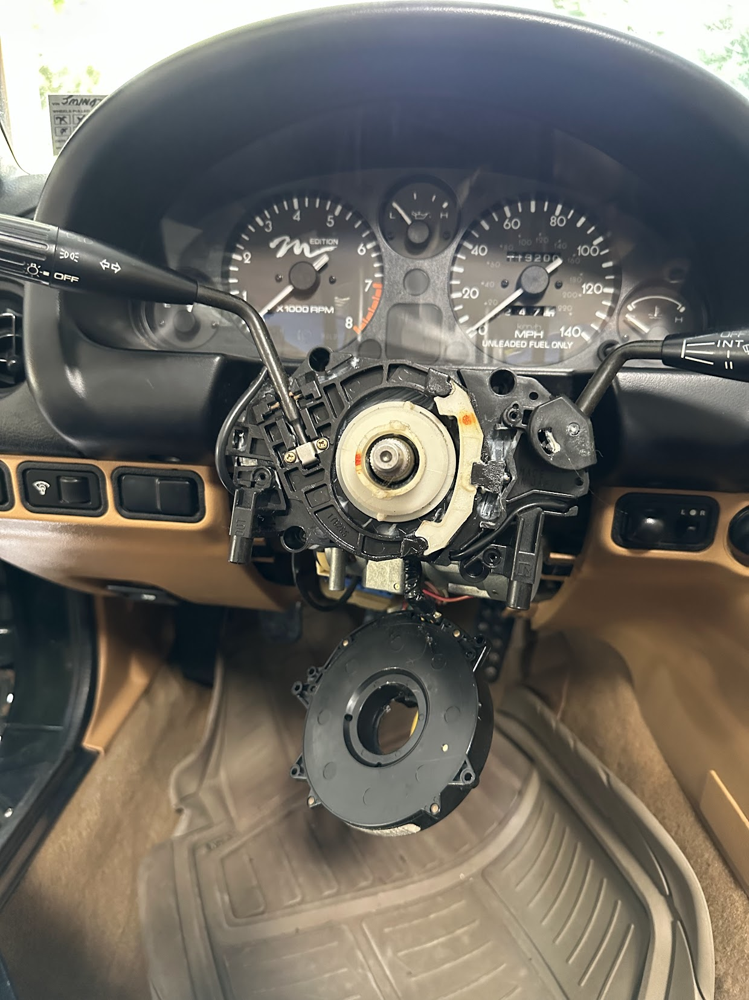
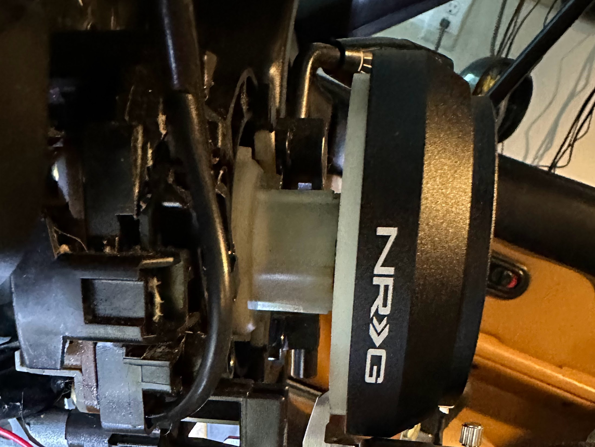
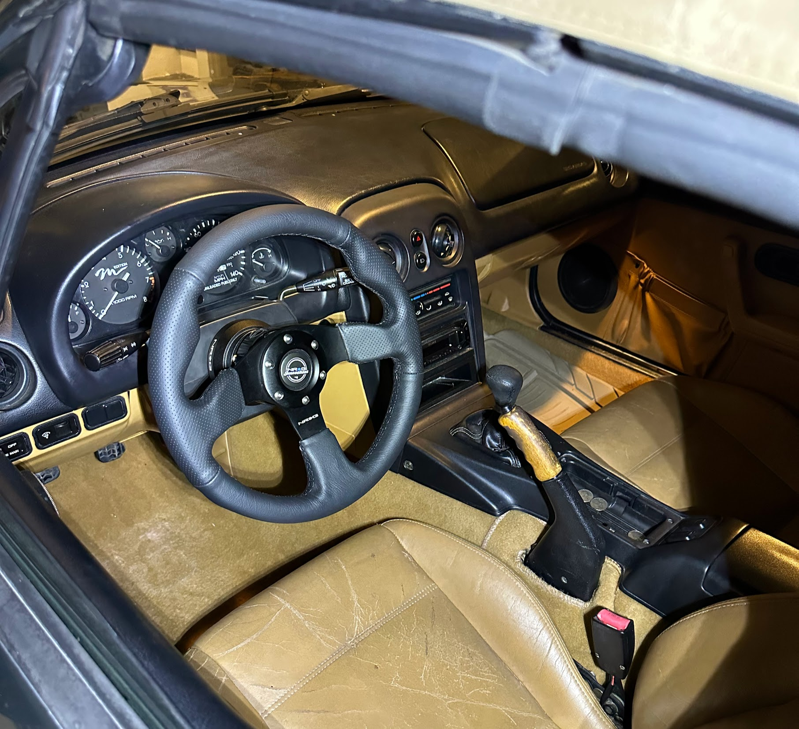
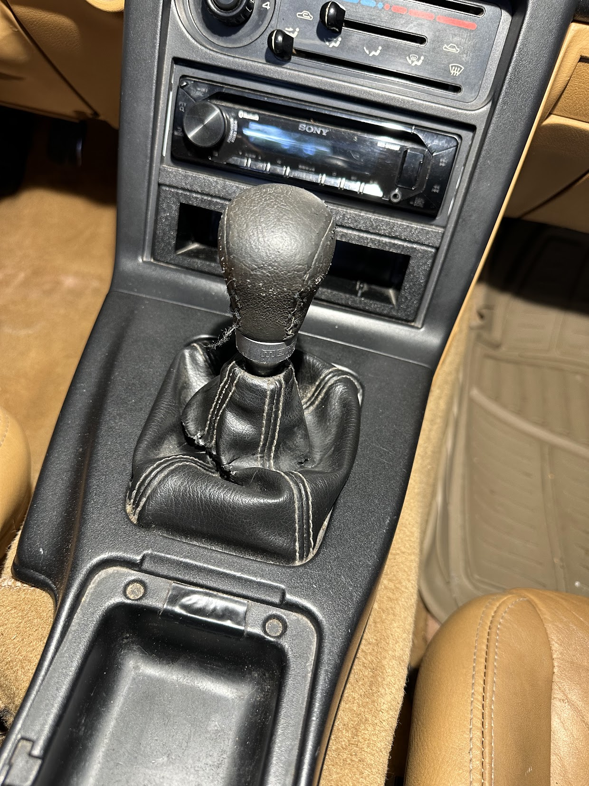
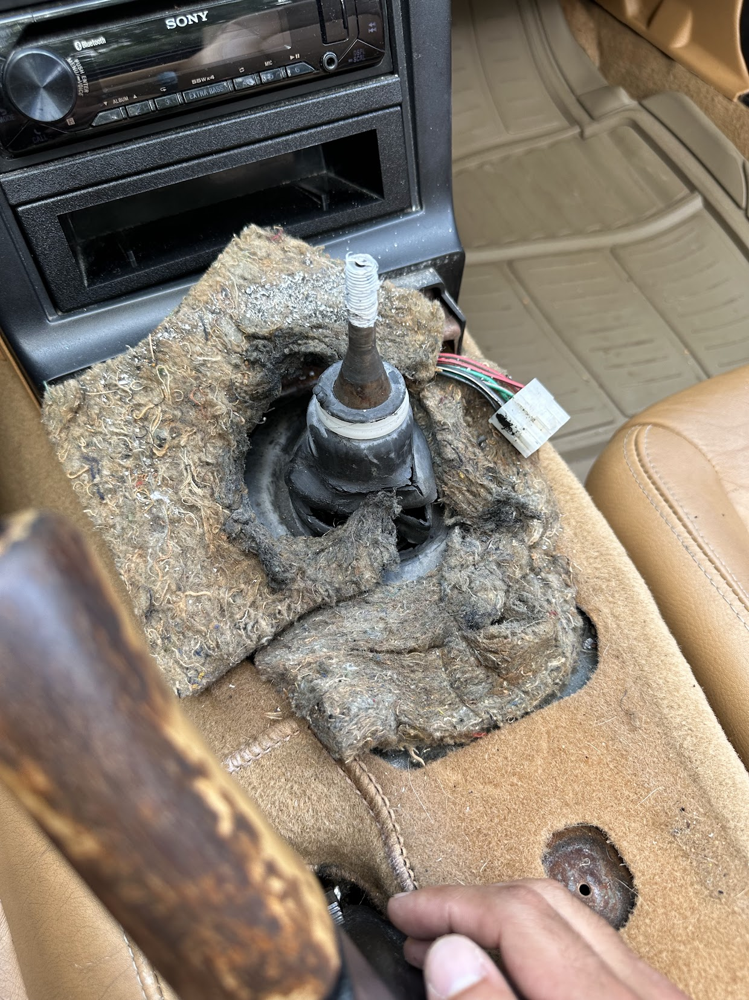
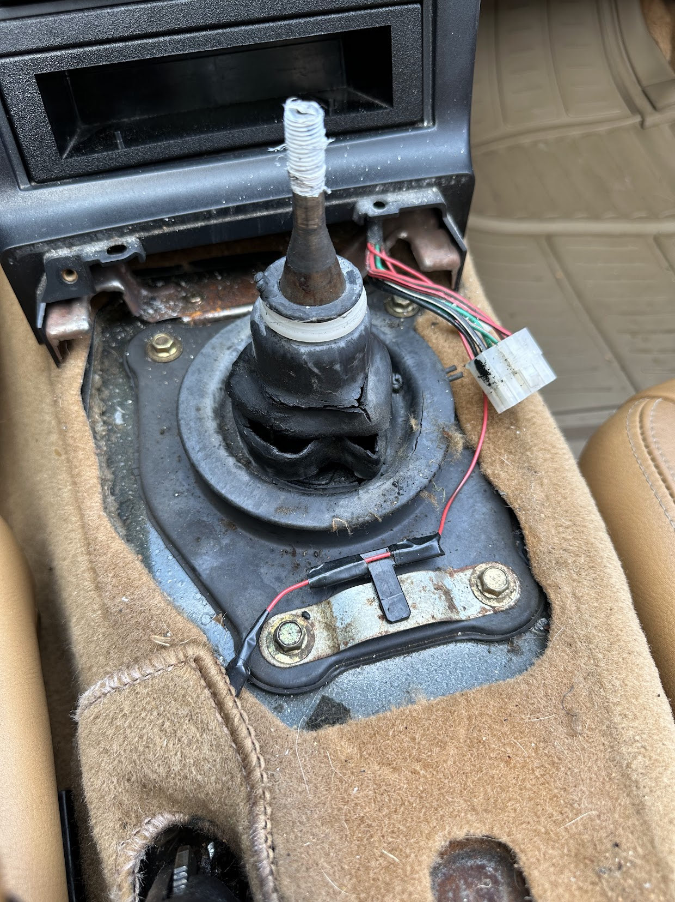
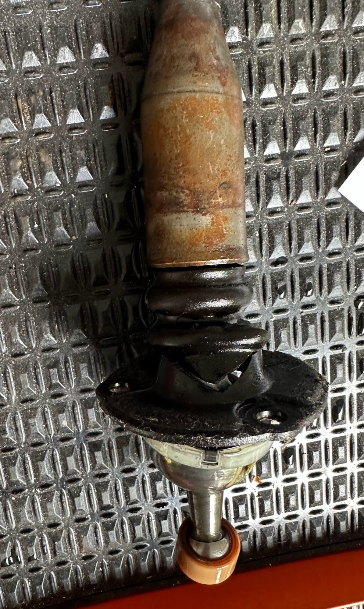
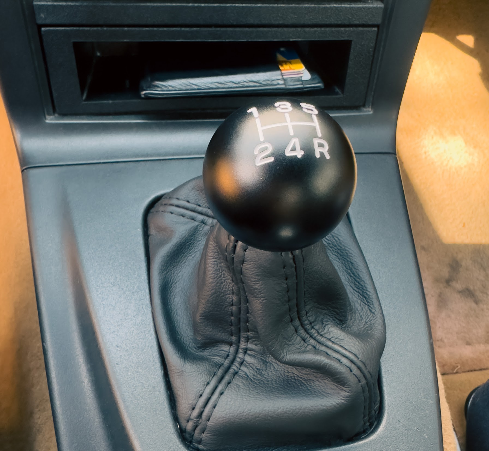
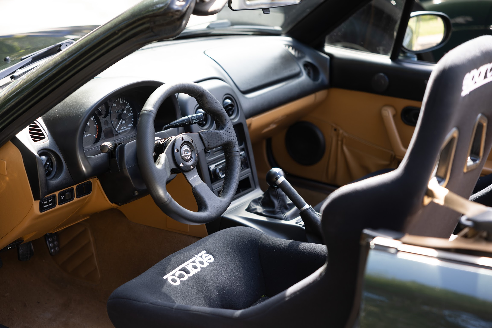

# Updating the Interior

After addressing some of the higher priority mechanical items, it's time to improve the interior of this car. I'm going to start with the steering wheel, then I'll replace the seats, and finally I'll rebuild the shifter assembly.

## Steering wheel

Presently, as I drive, the steering wheel deposits 25 year old leather crumbs into my hand. Let's try to replace it with something newer. I disconnected my battery so the airbag wouldn't deploy as I removed the old steering wheel.

Out came the old wheel, and in went an NRG quick release hub.

This hub allows the driver to detach the steering wheel prior to getting out of the car. The Miata is a small car, and once a race seat is fitted there will be limited thigh-room. Having the option to remove the wheel makes it easier to get in and out. 

The final diameter of the steering wheel is much smaller which results in a sharper handling feel.

## Seat

Next up is the seat: the current seat is torn in a few places. Additionally, it doesn't provide much support when cornering hard. Ultimately this car will have a 4 point harness and at that point changing the seat won't be optional.

I grabbed a pair of *Sparco Sprint* seats, with some *Sparco* mounting brackets. The *Sparco Sprint* seats fit in the NA Miata without having to modify the door cards or hammer in the transmission tunnel. Commonly, people will mount the seat directly to the car and give up the ability to adjust their seat. I want other people to be able to drive this car so I chose to mount the seat on the stock sliders.

 
I cleaned out and regreased the slider. After a mild amount of cutting and persuasion the seats were attached to the mounting brackets, and the mounting brackets were bolted to the sliders.

These seats are track oriented bucket seats. They provide strong side bostering to hold you in place when you're cornering hard. Donut media illustrated the difference between most stock seats and bucket seats in [this video](https://youtu.be/zO4wFEfl6ng?si=GxsmTSEoiV1M-TVt&t=87) (jump to the end to see how bucket seats perform). 

I'm not sure exactly what classes I'll be competing in long term, but thankfully these seats are FIA certified until 2028, which provides me with a large amount of flexibility. 

## Shifter assembly

Like the steering wheel, the shifter knob disentegrates everytime I glance at it. The knob presently rotates freely, and heat radiates from the leather boot which is torn.

I disassembled the entire shifter assembly, finding every layer to be in bad shape along the way. I also found Teflon tape under the universal shift knob. 

In the shifter assembly there's nylon bushings which degrade over time, I grabbed a [shifter rebuild kit](https://flyinmiata.com/products/1997-shifter-rebuild-kit) and replaced all the nylon pieces. 

This made the shfiter feel more precise and notchy. I also replaced all the rubber boots, and added fresh [heat insulation](https://flyinmiata.com/products/shifter-insulation-kit-na-nb). Because of the rebuild and the [transmission service](https://miata.blog/p/first-pass-of-maintenance) we performed earlier, the shifter now feels like it did 25 years ago.

With these 3 changes the interior is starting to be a very pleasant place to be.

## Outstanding items

+ Our windshield has a big chip in it.
+ Oil change, and fuel filter replacement.
+ Driver's side mirror wobbles a lot. 
+ To race, we need a roll bar in many classes, and a 4 point harness in some classes.
+ There's a vibration at 85+mph. And there's a squeal during deceleration. I suspect the driveshaft.
+ The stock suspension is very soft, I plan to install adjustable track oriented suspension and install harder polyurethane bushings in place of the 25 year old rubber bushings - the inherent softness of rubber has not been helped by age. 
+ The speakers sound very bad, and the head unit decides to beep a strange Sony theme song as a goodbye every time the car turns off.
+ The windows move very slowly.
+ The prior owner broke his key in the ignition, and as a fix decided to replace just the ignition assembly without changing the other locks in the car. So the car has 1 set of keys for the doors and a separate key for the ignition. 
+ The brakes fade very quickly, the pads and fluid may be at the end of their life. But it's common to just upgrade to Flyin' Miata's Big Brake Kit for a larger thermal capacity.
+ Once all of these issues are sorted out, we'll embark on the journey of making more power.