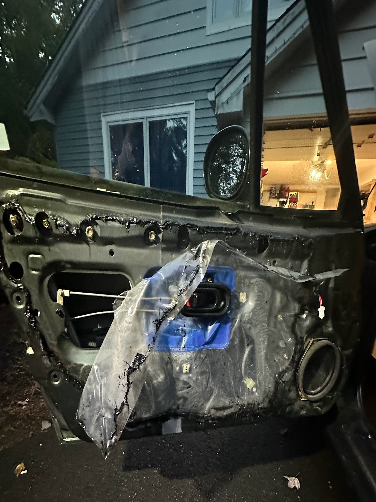

# Windshield Repair, Faster Windows, and More

This weekend we're going to knock out some non-glamorous maintainence items:
+ Address the chip in the windshield
+ Make the window go up and down faster
+ Change the fuel filter and oil

## Windshield chip

While I was driving on the highway a rock flew up and hit my windshield. I considered having Safelight repair it. So far I've figured out how to do everything on a car myself, so I was curious if I could do this as well. I [compared](https://www.youtube.com/watch?v=2fxxfZDOD1U) a few windshield repair kits I went for one from [Permatex](https://www.amazon.com/dp/B000ALJ4MY?ref=nb_sb_ss_w_as-reorder-t1_k0_1_8&amp=&crid=3C3H7R175CQ3G&amp=&sprefix=permatex).

The process involved using the syringes and the *pedestal*  included in the kit to inject a resin into the damaged area. This damage is probably towards the extreme edge of what this kit can handle, so I don't expect perfection. I'd just like it to be less distracting and less likely to grow into a larger problem.

Overall this went pretty well. It's not flawless and you can spot it if you know what you're looking for. But it's very easy to register it as a smudge and ignore it. On a smaller chip I think the results would be closer to perfect.

## Window speed

It takes almost 20 seconds for my passenger window to roll up and down, and it takes about 15 seconds for the drivers side. And so, into the door we go to see what's going on. If everything is intact, we'll just clean and lubricate the path the window takes. If anything is broken I expect it to be the window bushings. So before I got started I grabbed a set of [replacements](https://www.amazon.com/gp/product/B09V287JKN/ref=ppx_yo_dt_b_search_asin_title?ie=UTF8&psc=1) just in case.

 
My dad and I pealed back the layers of the door, and on the drivers side just cleaning and lubricating was all we had to do. Doing this brought down the window travel time to 5 seconds. On the passenger side when we pulled out the window we saw that a bushing was missing.

At the bottom of the door we saw the many pieces that used to make up the old bushing. I fished them out while my dad applied the new bushing. Like the driver's side we cleaned and greased the rails. Once the door was back together the window went down in 5 seconds like the driver's side. Success!

Getting into the door was a bit of a hassle, mainly due to the vapor barrier that's adhered to the door. Unfortunately, looking at our outstanding issues, this won't be the last time we have to get in here.

## Other maintainence

I got a new *Bosch*  fuel filter. 
A pretty straightforward procedure, but I'm not sure it's possible to do without getting gasoline on yourself.

When I went to change the engine oil, I found that the old oil filter was surprisingly difficult to remove on a car that's otherwise been very easy to work on. Always a bummer when you have to wait for [a tool](https://www.amazon.com/HORUSDY-Adjustable-Filter-Pliers-Removal/dp/B098JDWN1T/ref=sr_1_3_sspa?crid=1OW0GYS9K7KTF&keywords=oil+filter+pliers&qid=1695349420&sprefix=oil+filter+pli%2Caps%2C77&sr=8-3-spons&sp_csd=d2lkZ2V0TmFtZT1zcF9hdGY&psc=1) to show up to complete a job. But ultimately, with the new tool, the old oil was drained, and a round of fresh oil was poured. I used an [oil filter](https://www.amazon.com/gp/product/B000C4087Y/ref=ppx_yo_dt_b_search_asin_title?ie=UTF8&psc=1) with a nut on top just to give me another option for removal in the future.

## Outstanding items

+ ~~Our windshield has a big chip in it.~~
+ ~~Oil change, and fuel filter replacement.~~
+ Driver's side mirror wobbles a lot. 
+ To race, we need a roll bar in many classes, and a 4 point harness in some classes.
+ There's a vibration at 85+mph. And there's a squeal during deceleration. I suspect the driveshaft.
+ The stock suspension is very soft, I plan to install adjustable track oriented suspension and install harder polyurethane bushings in place of the 25 year old rubber bushings - the inherent softness of rubber has not been helped by age. 
+ The speakers sound very bad, and the head unit decides to beep a strange Sony theme song as a goodbye every time the car turns off.
+ ~~The windows move very slowly.~~
+ The prior owner broke his key in the ignition, and as a fix decided to replace just the ignition assembly without changing the other locks in the car. So the car has 1 set of keys for the doors and a separate key for the ignition. 
+ The brakes fade very quickly, the pads and fluid may be at the end of their life. But it's common to just upgrade to Flyin' Miata's Big Brake Kit for a larger thermal capacity.
+ Once all of these issues are sorted out, we'll embark on the journey of making more power.

