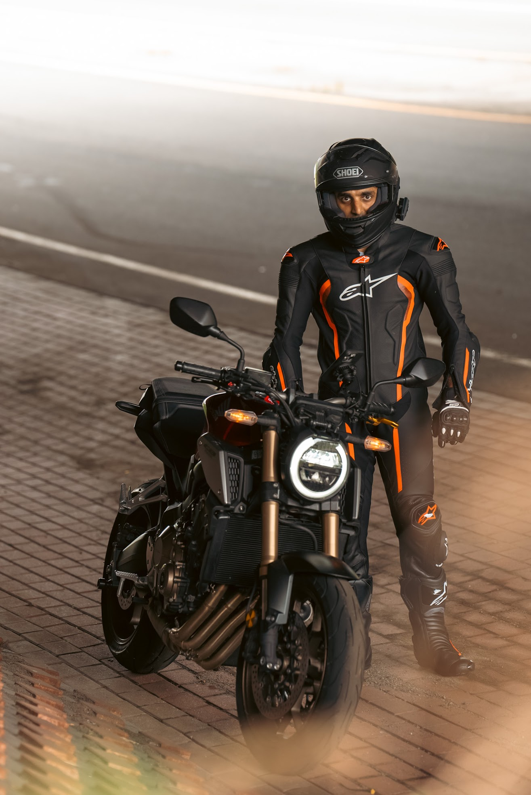

# Jan 26 - 10k
* sold to adam
* feel thoughts:
  * steel braided cables
  * adjustable suspension
* ecu thoughts:
  * standalone ecu will give you up-quickshifter (possibly down as well)
  * also more power and prob should be done anyways because full exhaust

# Aug 25 - 9.5k
- oil and filter changed
- Chain lubed
- tire pressure checked and held at 32 & 34 PSI front back. No longer concerned about a leak of any sort.

# October 24 - 8.4k
* front tire pressure low for the second time, topped up to about 32 psi
* Oil & Filter changed
* Rear brake fluid flushed

# July 24 - 7.8k
- Engine air filter changed
- OEM quickshifter installed, but unfortunately the stock non-abs ecu doesn't support the upshifter. Powercommander apparently does support this quickshifter so may be worthwhile in the future.
- Chain and Front sprocket cleaned
- Coolant change performed, initially had an air pocket which caused the bike to overheat during test run. Air bled through service procedure's indicated valve.
- Quad Lock wired in properly, and configured to "Auto" shut off.
- Finally set the clock.

# June 24 - 7k 
+ tail tidy fixed, slightly wrong tail tidy ordered, made to work
+ tiny oil leak discovered, possibly infamous "water pump leak", seems to be most drippy after a hard ride on a hot day
	+ 7.8k: got the sense that it was chain lube or motor oil 
	+ This was later confirmed to be just a loose drain bolt 
+ Chain cleaned and lubed
+ Rear spools installed, ever so slightly leans right
+ Akrapovic full exhaust installed, not all springs were able to be installed without some surgical pliers
+ Seat bolts replaced
+ Levers replaced due to a bend after a drop by me
+ Quad lock installed, but not comletely
+ Loose horn tightened, unclear if it's the source of a flapping noise at high rpms
+ front brakes changed for ebc brakes, also brake fluid changed. The brake fluid was not that dark, but was darker than what went in. I put in Bosch brake fluid from amazon. Feels like a marginal improvement, will probably keep stock brake pads.
+ Tires were squared off so I replaced them with [Michelin Pilot Power 120/70zr17 & 180/55zr17](https://www.amazon.com/gp/product/B0076ZM19U/ref=ppx_yo_dt_b_asin_title_o00_s00?ie=UTF8&psc=1). Unfortunately I scratched the rim and will need to remediate the situation in the future.
# May 24 - 6k: Purchase
Purchased from: `Ted Dalakos, 63 Paradowski Rd, Schenectady, NY 12302`
VIN: `MLHRH0218K5000126` 
Miles: 6200
Not running when purchased
Purchased for $5700
+ Oil changed

# Problems 
- gunk build up behind chin guard
- Quad lock wired properly