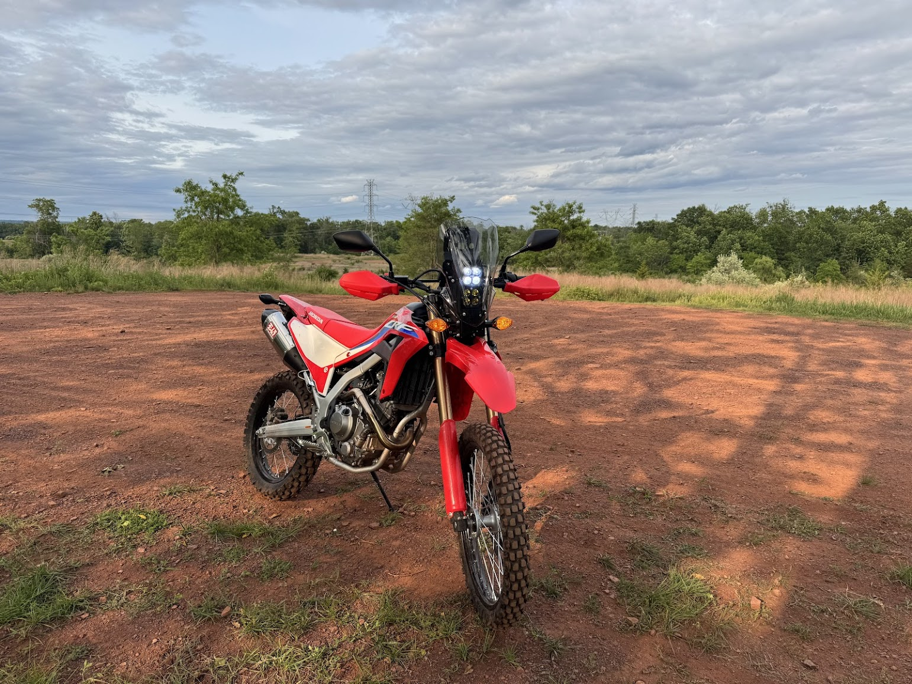
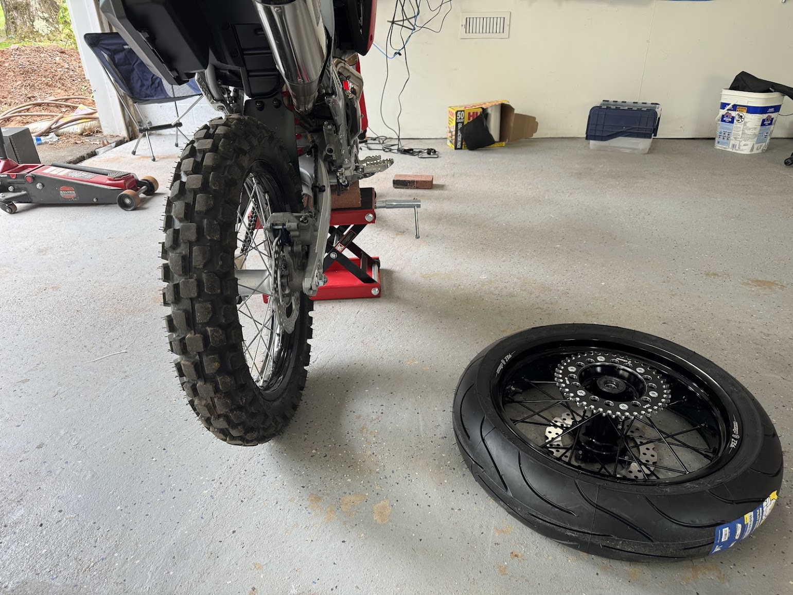

# 1700 miles off-season refresh Febuary 26
## 

# 1700 miles Aug 25
* Oil & filter changed 

# 1600 miles
+ back to dirt form
+ adventure rally tower <!-- {"fold":true} -->
	+ required heavy modification of the rally tower itself due to a desired re-location of the ignition key that I was not willing to do
	+ is mounted on 5/6 of the screws and one of the switch panels had to be re-located
	+ relay tapped into rear brake light as signal + a switch on the rally tower
+ many light mounts were tried for additional lighting but none of them really worked, so they were all returned. Sizes from 2in-2.5in were tried. But they re-use the same metal housing with different rubber inserts and 2.25 is too big metal, and 2.0 is too small metal. I need like 2.125 or something.
+ chain lubed

# 800 miles
+ oil change
+ throttle cable adjustment
+ clutch cable adjustment
+ chain alignment check
+ chain lubrication

# 570 miles - `SM`
+ warp 9 supermoto conversion
	+ Required me to trim the fork plastics mildly.
	+ Uses a larger sized rotor in the front which feels better, probably will get another rotor for the dirt setup to match.
	+ Required me to remove the chain guard.
	+ Speedo probably mildly innacurate beyond this point
	+ Will require an adjustable kickstand
+ Yoshimura tail tidy

# 400 miles
+ Yoshimura RS-4 Full Exhaust System
+ 550 Performance Stage 1 91 octane map
	+ I lil shaky at some rpms, will see if letting more air in helps

# Info

2024 Honda CRF300L (RED)

Purchased new at Motorcycle Mall for $7,162 on 4/13/24.

VIN: `MLHND1611R5300059`

# Motivation

+ Get a beginner bike I would want to keep.
+ Have an off road capable bike.
