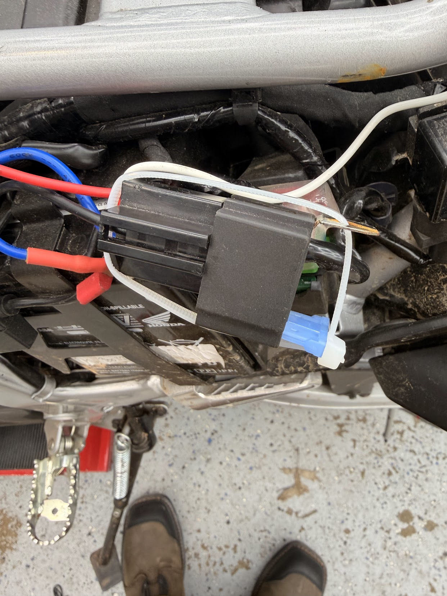
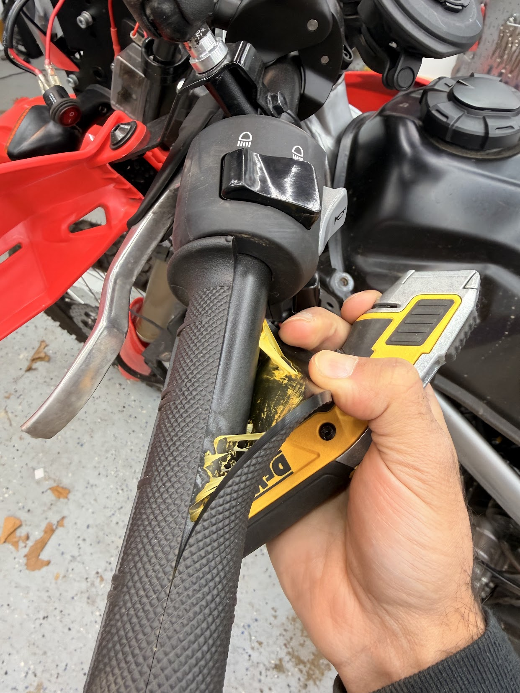
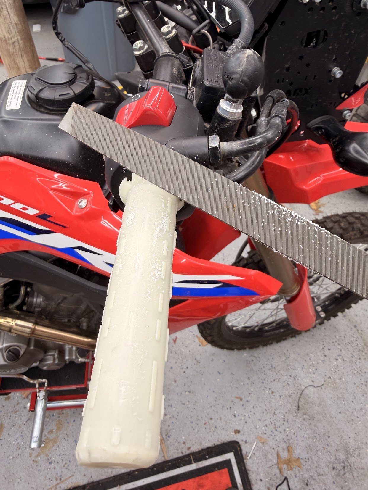
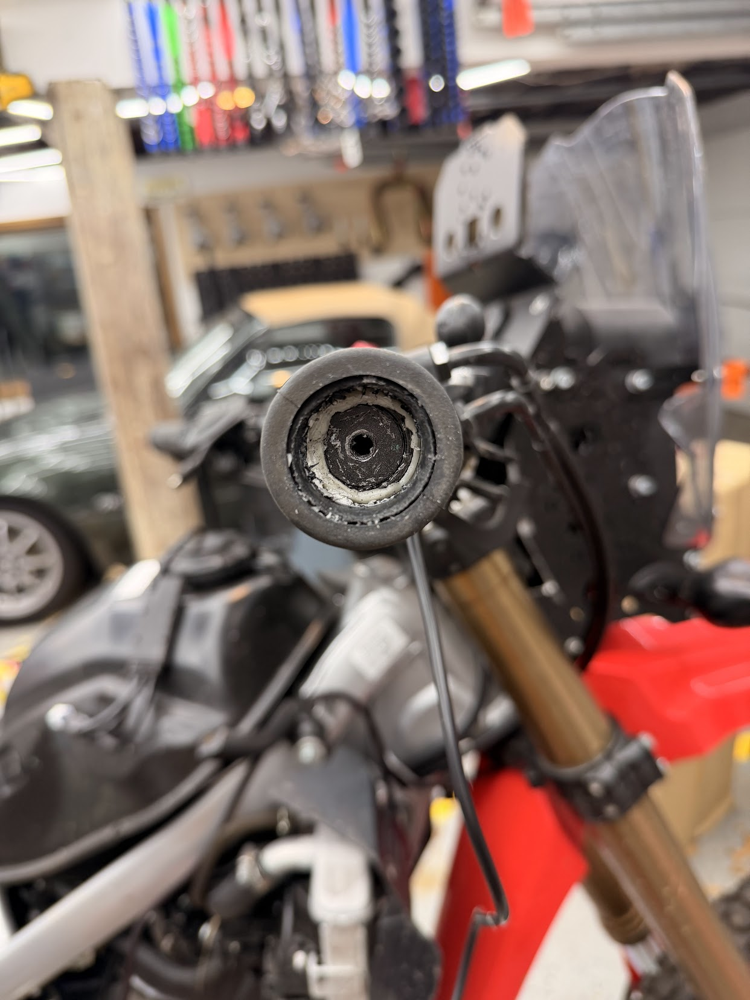
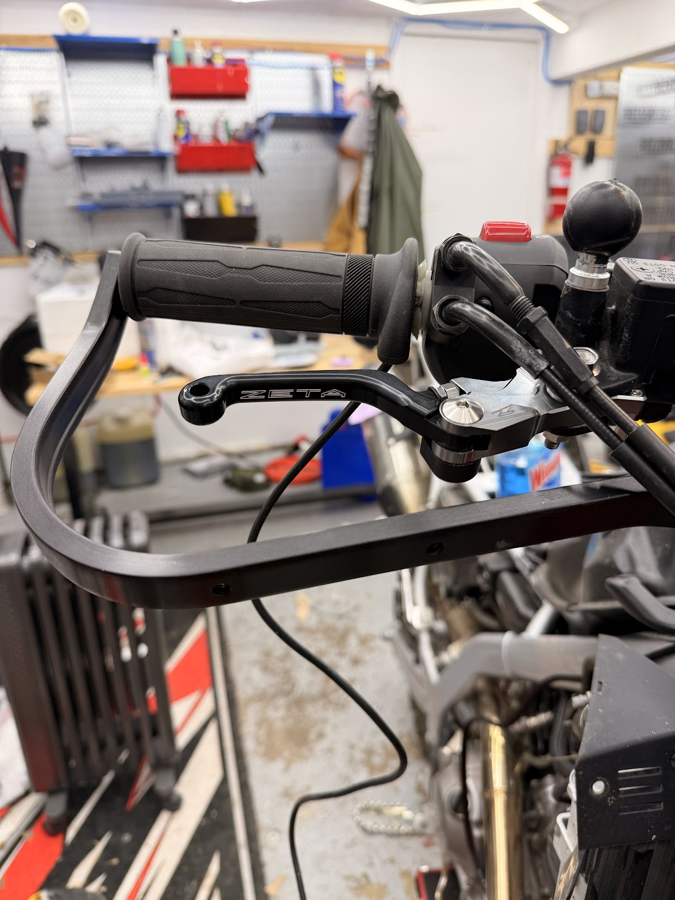
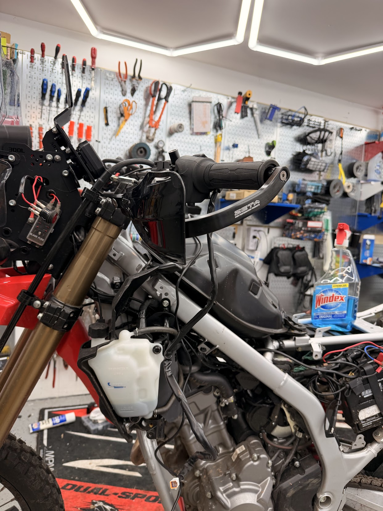
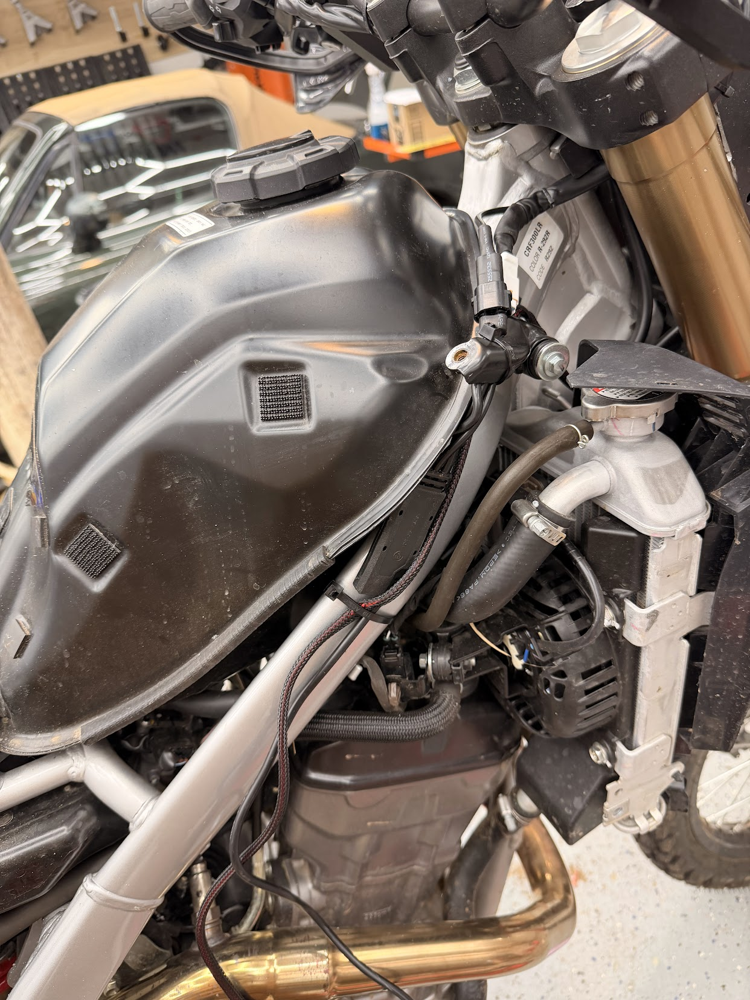
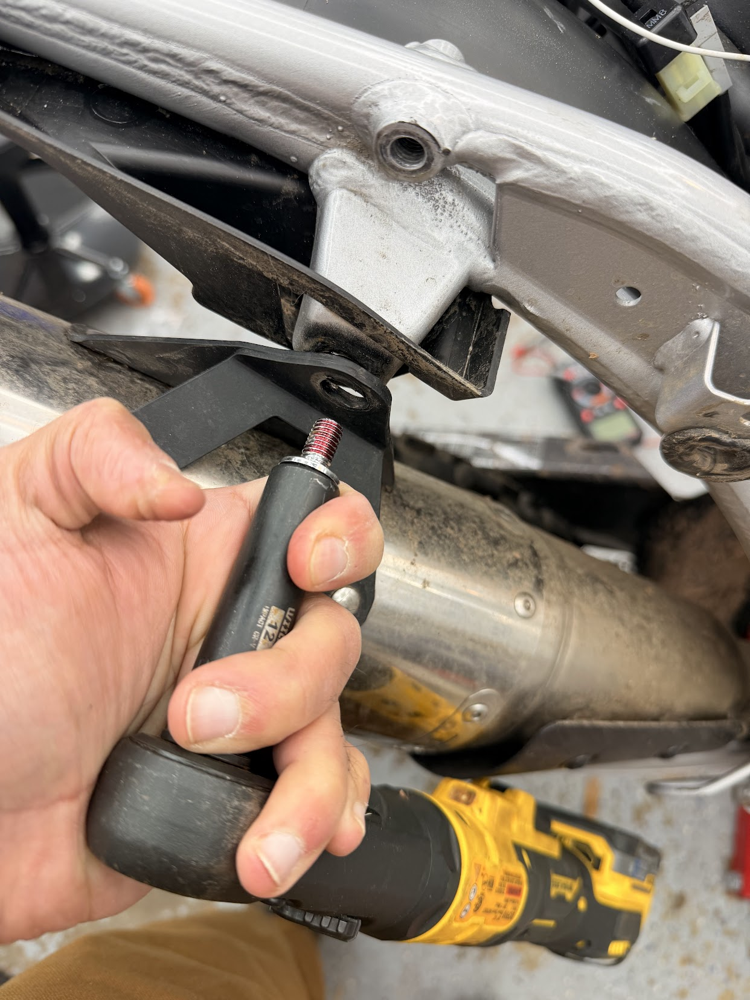
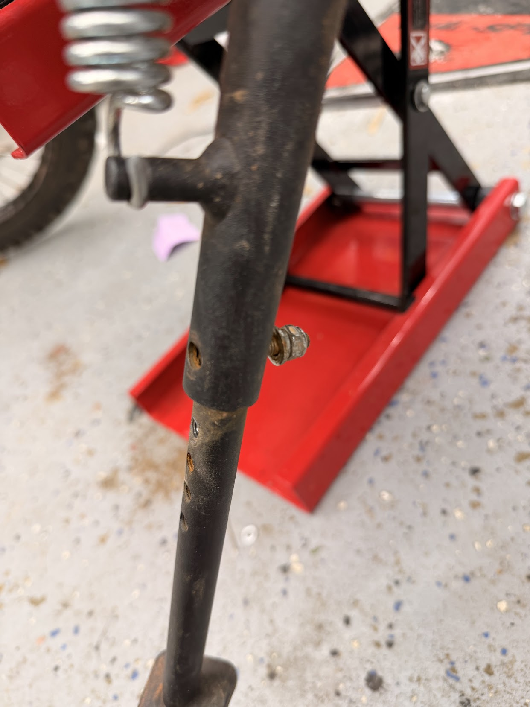
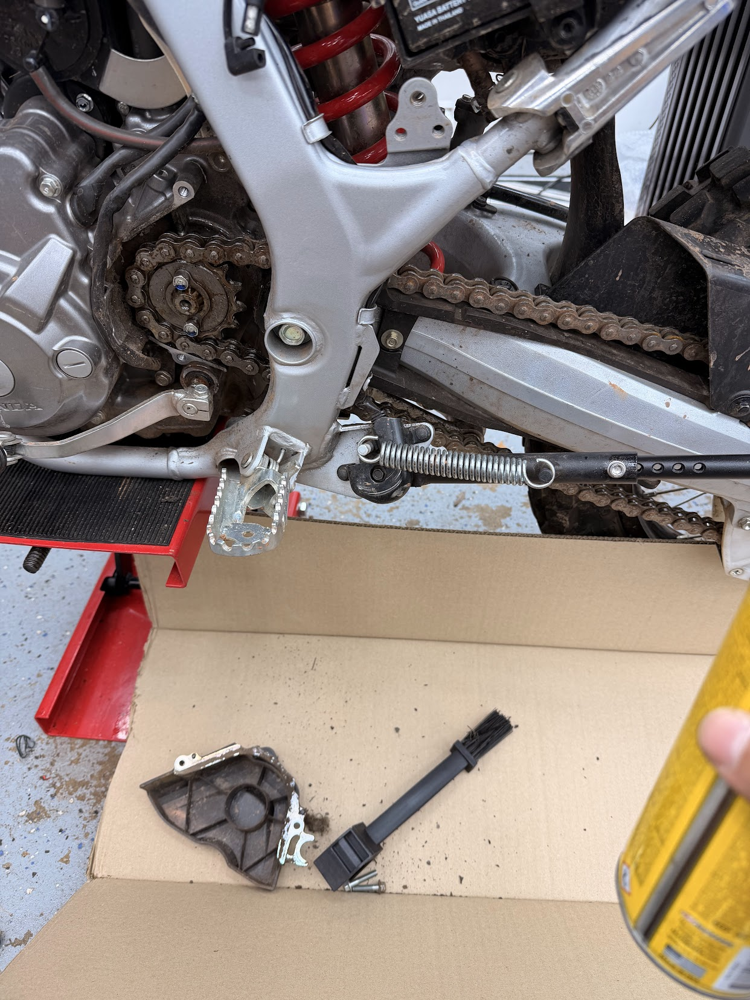

# 1700 miles off-season refresh Febuary 26<!-- {"fold":true} -->

## Lighting fix<!-- {"fold":true} -->

This fuse fell out of this relay, so I zip tied it back on. 

## Heated grips<!-- {"fold":true} -->
Old grips cut, throttle tube had to be filed and cut, pretty annoying. 

Ultimately got it on and made sure throttle operation was smooth. There's a tiny rattle from one of the spacers, we'll have to see if it's noticable while riding. If so we'll have to go in and remove more material from the throttle tube and that should let us tighten things down more significantly.

## Hand guards<!-- {"fold":true} -->
Zeta hand guards and levers installed.

## Aux wiring<!-- {"fold":true} -->
Utilizing the factory aux connection for the hand grips and re-wiring the quadlock. 

## Bolt fixes<!-- {"fold":true} -->
Exhaust bolt was loose, it has been locktited: 

This horrible broken screw had to be extracted from the kickstand and replaced:

## Maintainence<!-- {"fold":true} -->
Chain and sproket guard lubed.

# 1700 miles Aug 25<!-- {"fold":true} -->
* Oil & filter changed 

# 1600 miles<!-- {"fold":true} -->
+ back to dirt form
+ adventure rally tower <!-- {"fold":true} -->
	+ required heavy modification of the rally tower itself due to a desired re-location of the ignition key that I was not willing to do
	+ is mounted on 5/6 of the screws and one of the switch panels had to be re-located
	+ relay tapped into rear brake light as signal + a switch on the rally tower
+ many light mounts were tried for additional lighting but none of them really worked, so they were all returned. Sizes from 2in-2.5in were tried. But they re-use the same metal housing with different rubber inserts and 2.25 is too big metal, and 2.0 is too small metal. I need like 2.125 or something.
+ chain lubed

# 800 miles<!-- {"fold":true} -->
+ oil change
+ throttle cable adjustment
+ clutch cable adjustment
+ chain alignment check
+ chain lubrication

# 570 miles - `SM`<!-- {"fold":true} -->
+ warp 9 supermoto conversion
	+ Required me to trim the fork plastics mildly.
	+ Uses a larger sized rotor in the front which feels better, probably will get another rotor for the dirt setup to match.
	+ Required me to remove the chain guard.
	+ Speedo probably mildly innacurate beyond this point
	+ Will require an adjustable kickstand
+ Yoshimura tail tidy

# 400 miles<!-- {"fold":true} -->
+ Yoshimura RS-4 Full Exhaust System
+ 550 Performance Stage 1 91 octane map
	+ I lil shaky at some rpms, will see if letting more air in helps

# Info<!-- {"fold":true} -->

2024 Honda CRF300L (RED)

Purchased new at Motorcycle Mall for $7,162 on 4/13/24.

VIN: `MLHND1611R5300059`

# Motivation<!-- {"fold":true} -->

+ Get a beginner bike I would want to keep.
+ Have an off road capable bike.
