# Basement June 2026 
* Water ingress seems under control and it's time to move into the basement.
* The boys came over helped demo a lot of poorly built structures, and helped install dricore
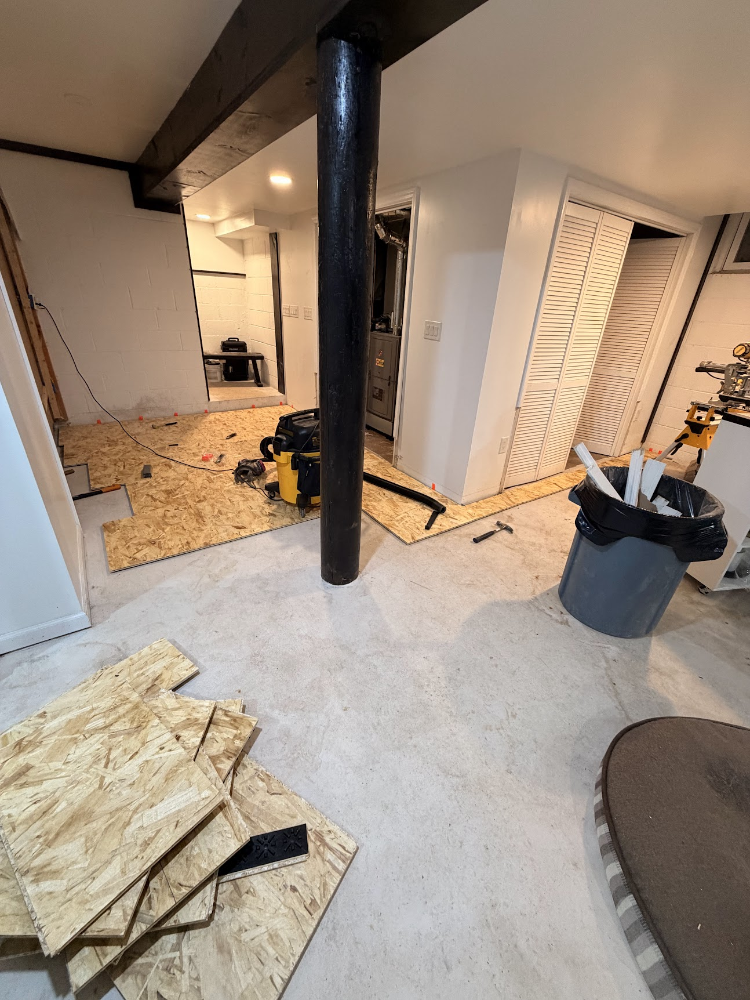

The basement will become livable via: dricore, closed cell foam, steel studs, and rockwool. Once we have faith in no more water ingress, we can sheet rock it up.

# Mailbox - April 2025

Someone hit our mailbox while leaving the driveway, we replaced it with a newer, larger mailbox. My first time doing a concrete pour. I dug a more significant hole than was needed, I believe this is stronger.

# Water Ingress Round 7 - Oct 2025

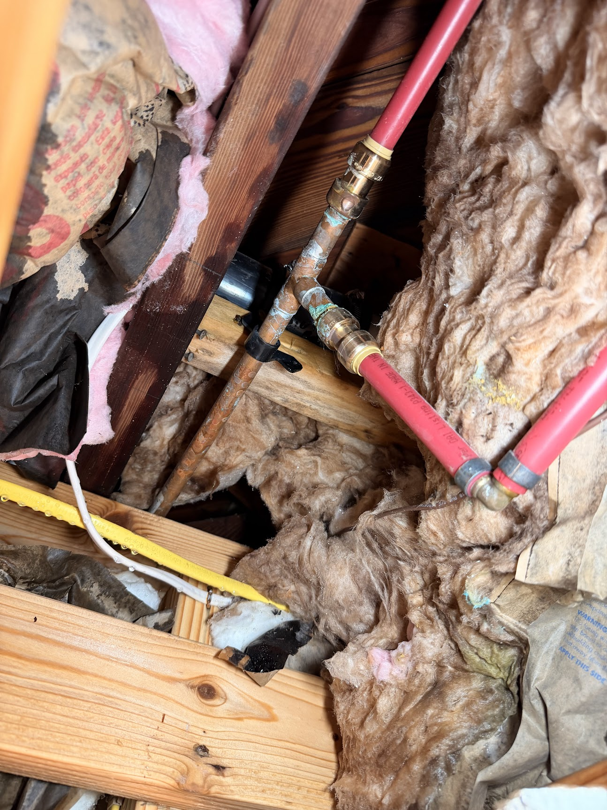

This random coper joint going to basically nowhere failed, it was replaced by me with a much simpler pex circuit:
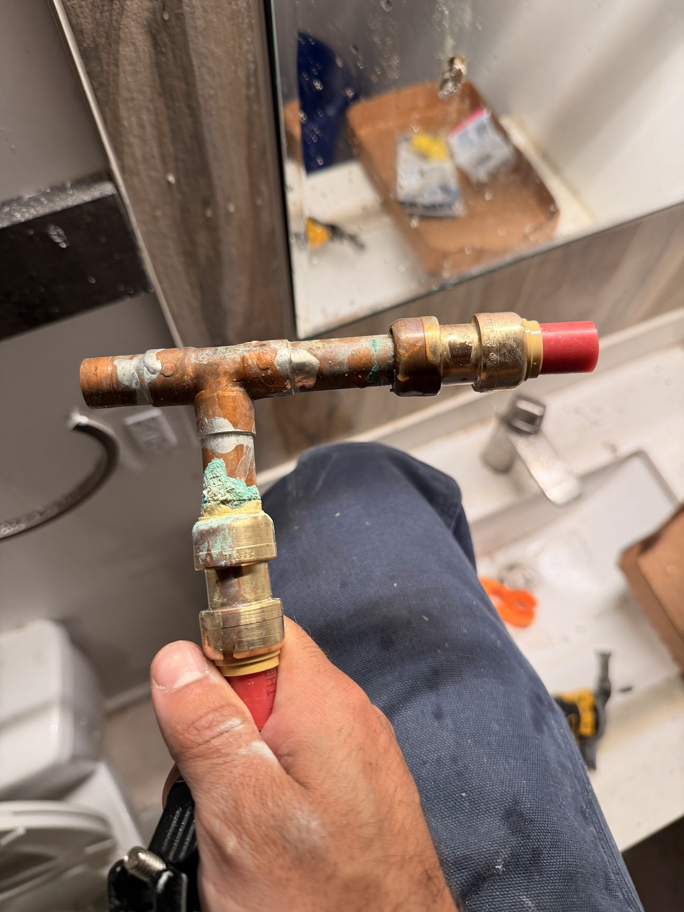

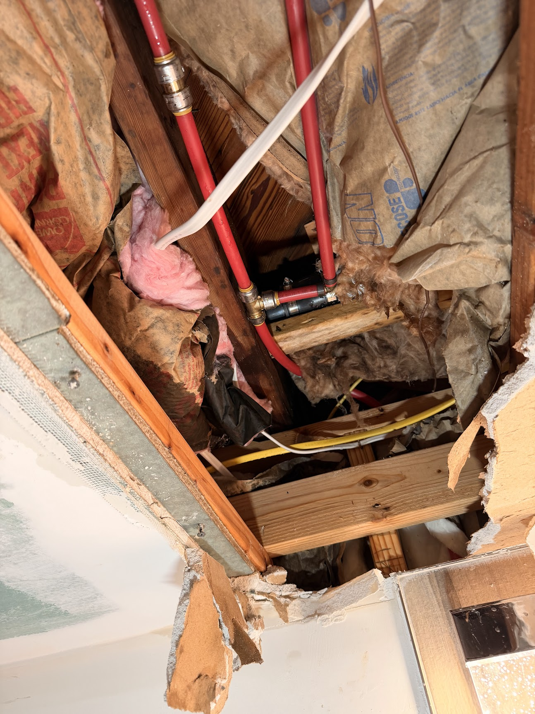

# Radon - Sept 2025

I purchased a radon detector and placed it in the living areas of the house, and we were in poor radon territory. 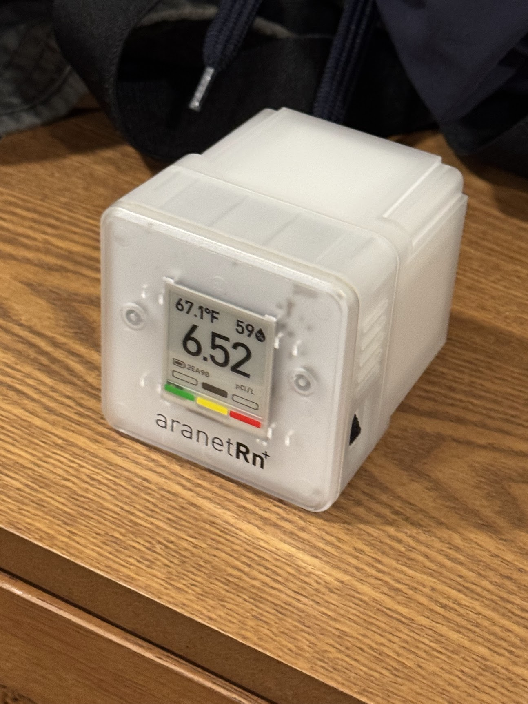. This was fixed by sealing off our sump pump and actively exhausting the air to the outside. Radon levels went from about 6-7 -> 1-2. 4 is CDC's advised "action threshold".

`todo: radon pic`

# Garage
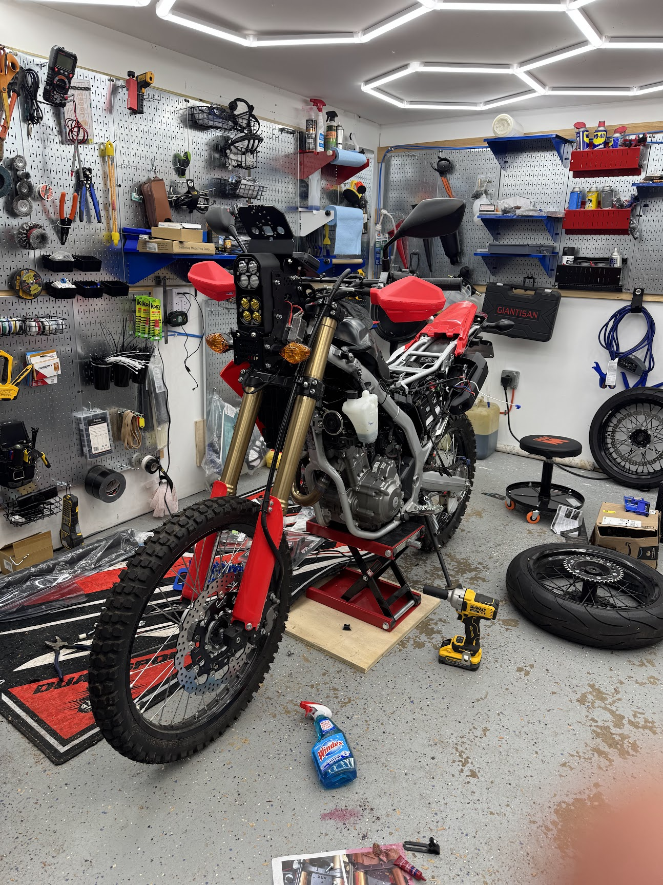

At this point the garage has grown into a sort of workshop. It's very well lit, and neatly organized. There are no horizontal surfaces for junk to collect and everything is hung on the walls. The wall space is maximized and can freely evolve. Perhaps the garage will get it's own document soon. The garage is basically a cache for everything I do regarding homes and vehicles.

# Office

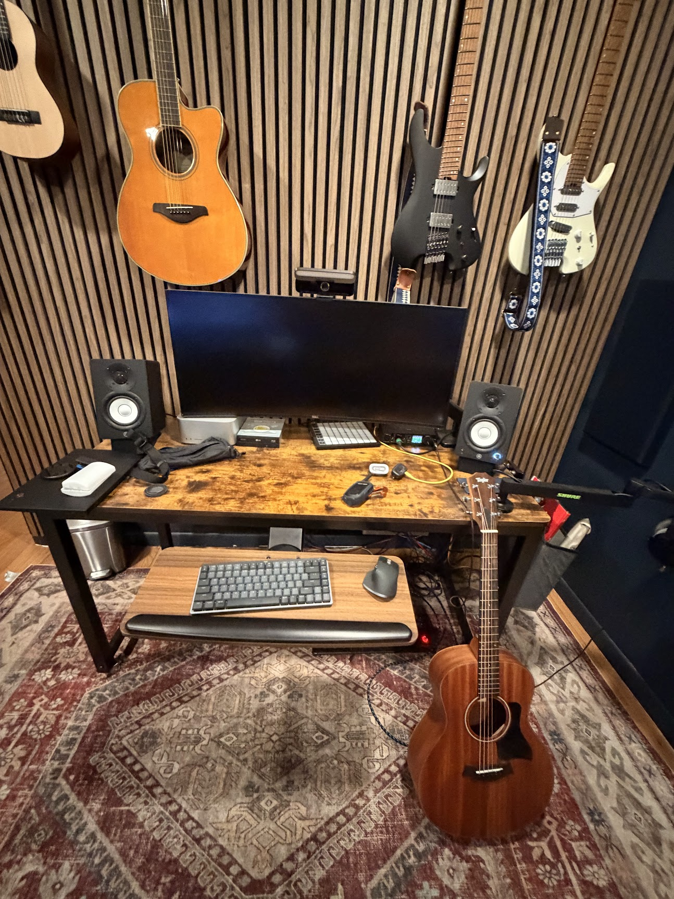

Adam came over and helped me create this office space with a couch and two desks. We added this sound treatement panel on the walls which helped a bit but my voice was still a bit echo-y. This and the garage are two spaces I'm really proud of. I look forward to building out the basement.

# Water Ingress round 6 - Jul 2025

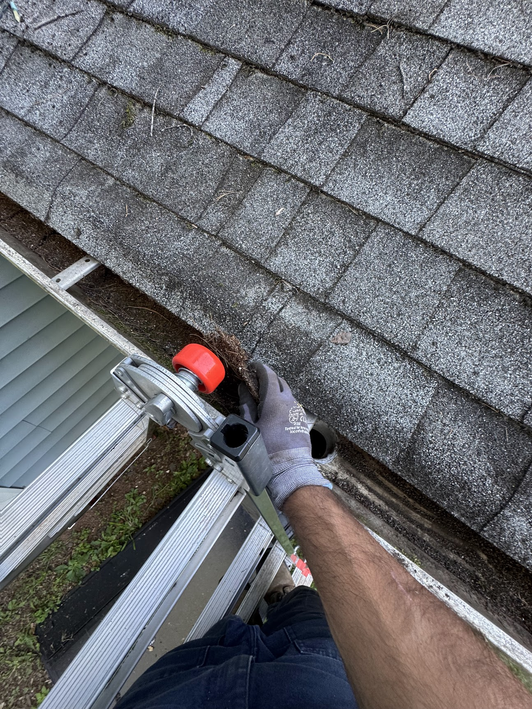

I watched a video that suggested if you have water at the bottom of your house you should start at the top and inspect your gutters. Parents had installed these gutter guards which were actually making it very difficult to see or clean the gutters. I removed all of them and cleaned out the gutters, and this made the biggest difference for water ingress into the basement.

# Water Ingress round 4 & 5
* Our AC was installed by a crackpot AC tech. The AC began to fail and the pipes that connected the inside unit with the outside began to freeze and drip water all along the ceiling of the basement, creating a mold far. All the drywall needed to be cut out. A proper new AC was installed from Gold Medal.
* Not too long after our hot water heater also failed and started dripping small amounts of water. This was also replaced by Gold Medal. If it wasn't for the natural gas, I would have done this myself.

`todo: pics`

# Water Ingress round 3 - Feb 2025

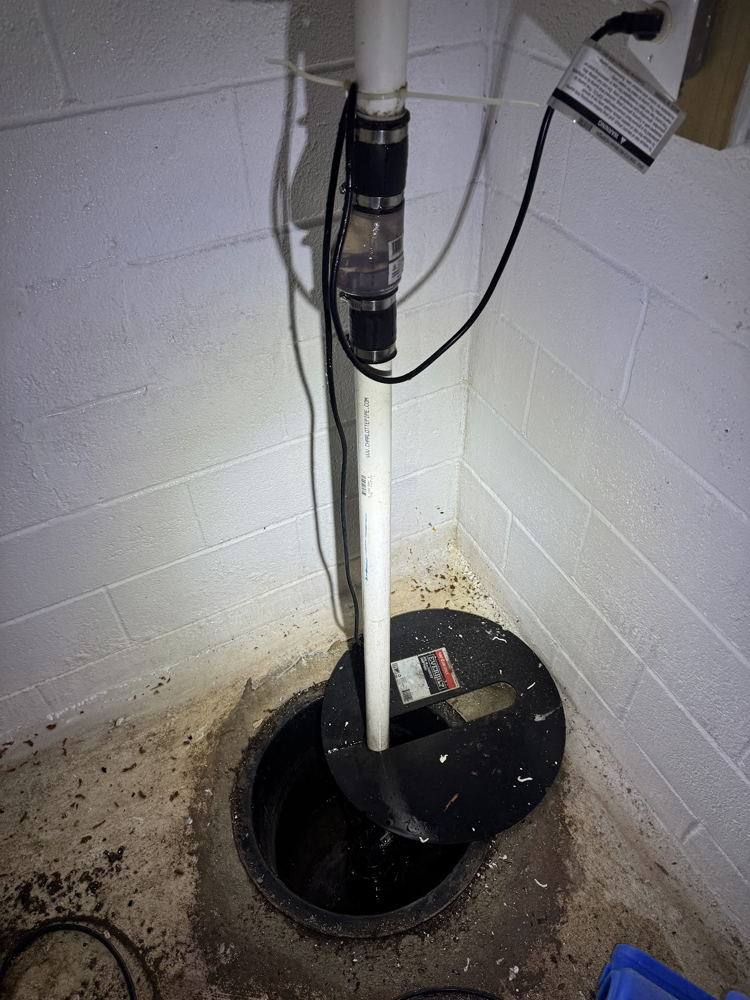
In our second sump pump one of these joints failed and sprayed water everywhere. Just tightened and it was fixed.

# Water Ingress round 2 - Oct 2024
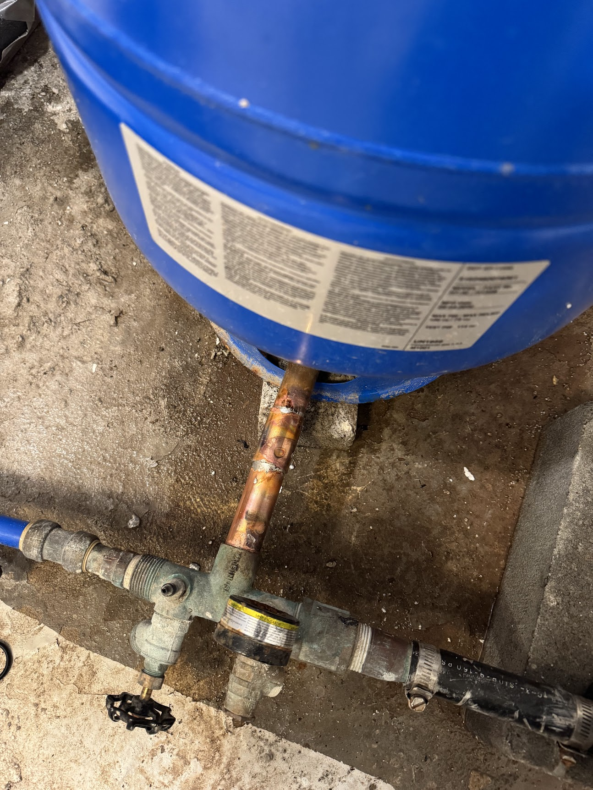

This well inlet seems to have formed a small crack and started spraying water everywhere. Had to emergency repair, still needs a proper repair.

# Water Ingress round 1 - Feb 2024
* we had some drainage problems, water would come into our basement space (due to multiple reasons). And we had massive outdoor flooding during heavy rain.
* to remedy this I tied in a section of the front yard which had the most significant puddles (flooded our front walkway regularly to a drain that went all the way to the stream in the backyard.

This worked in the sense that we never had big puddles again in the front, it wasn't however enough to prevent water from coming into the basement.

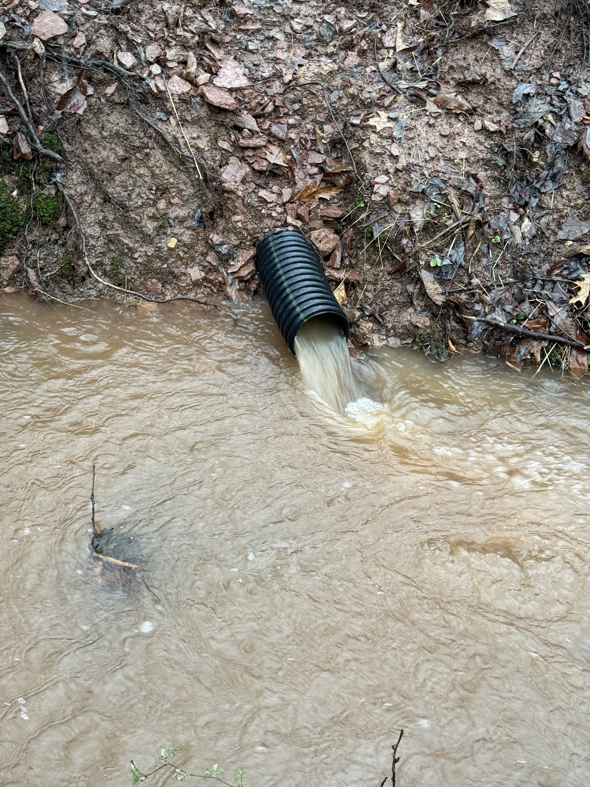

# First Home - 2024
My wife and I purchased this home from my parents in early 2024. Sharing a backyard with your parents is incredible.

Homeownership is harder than we expected it to be. We started off our journey re-modeling some of the key living spaces. Krishma got to design the bathroom of her dreams here. . 

# todo:
* finished bathroom
* wood working stuff
* Mailbox