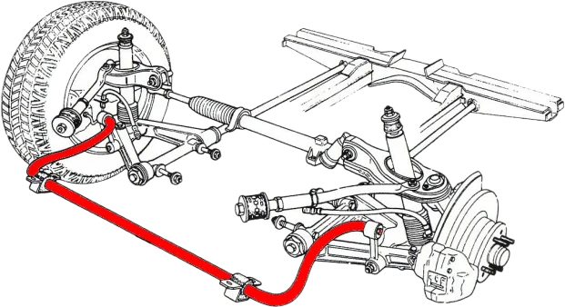
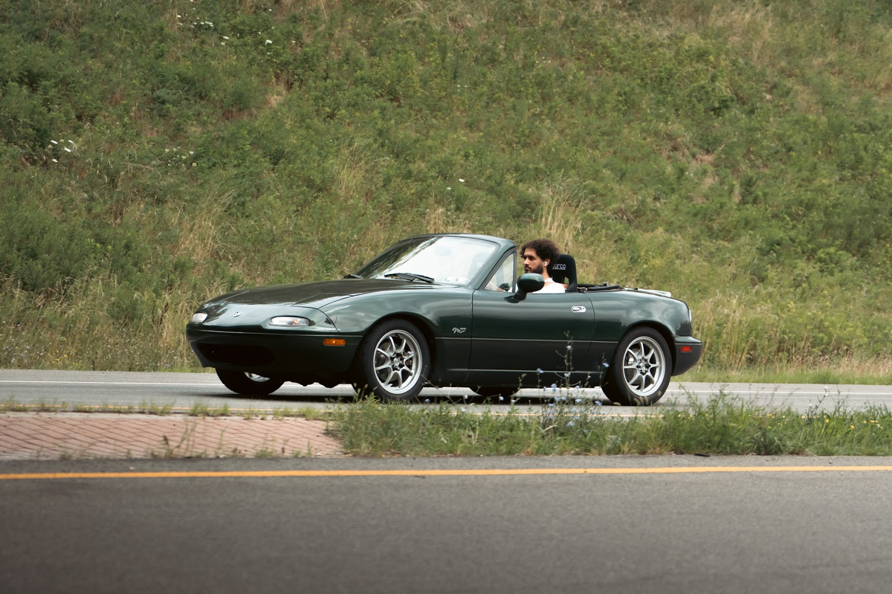
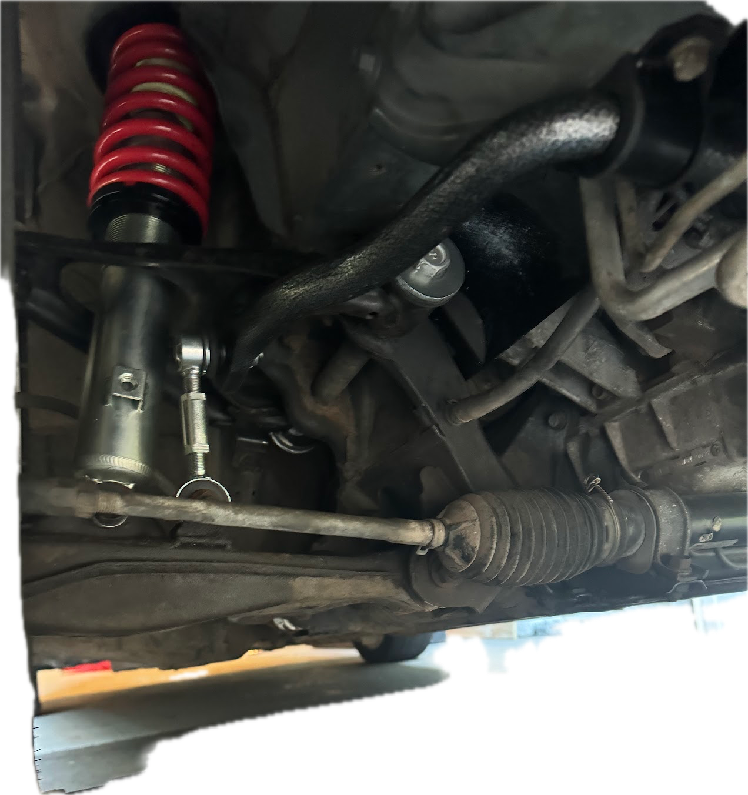
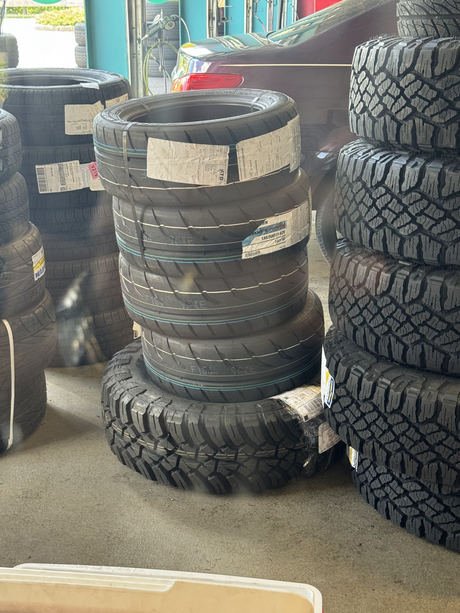

+++
title = "Autocross 2024"
date = 2025-05-29T19:32:33-05:00
draft = true

[taxonomies]
tags = ["wrenching", "miata"]
+++

# Tire & Suspension Upgrades
- Jun 17 suspension
- jun 22/23 suspension
- new tires Jun 27
- brakes Jun 29
- jul 5 new tail light
- auto cross album sept 8
- apr 13 key things

Where I last left you, we had autocrossed a few times in 2023 and identified two key weaknesses. Tires & Suspension.

I decided to start with the harder problem -- the suspension.

The current suspension is is optimized for comfort and globally varied driving situations. It's old, soft and tall, and I'd like to change all of these things. 

Pictured above is:
- red: a set of *coilovers* - stiffer springs *coiled* over a more aggressive dampener. The spring is responsibile for absorbing energy, and the dampeners are responsible for controling the rate at which the shock is able to compress and rebound. Think about spring rate as range of motion the wheel experiences, while the dampener ensures the car doesn't keep bouncing like a slinky indefinately. Higher end suspension that we may upgrade to in the future allows you to independently control how aggressively a dampener dampens compression and rebound. These coilovers *will* allow me to control ride height.
- grey bars: are much stronger sway bars, these connect opposing suspension members and limit the maximum difference in travel each side is allowed to experience. Effectively limiting body-roll. These sway bars are adjustable (multiple mounting points) and attach to the car via adjustable endlinks. By making the sway bar smaller, we make it stiffer. Having a stiffer swaybar in the rear allows us to increase the amount of *oversteer* the car experiences. Having a stiffer swaybar in the front would induce *understeer*.
 

These suspension upgrades in general should make the car behave much more predictibly at the edge of traction. Being at the edge of traction is like trying to navigate through a dark room. You can use a stiff skiing pole or you can use a floppy pool noodle. Which would be a more insightful tool during the process?

Information aside it should make the car feel far more responsive. Right now when I slam on the brakes or turn sharply I have to wait for the sloppy, existing suspension to compress fully before transmitting that load to the ground, tightening up all these passages should feel like reducing the latency in a video game.

With that being said, I recruited my good friend Smail, and we got to work.

This was Smail's first wrenching experience, and together we experienced all the highs and lows of wrenching:
- took way longer than expected
- hit some inexplicable road blocks
- found a mistake deep in the process that caused us to have to undo a bunch of our work

But before before it got dark, we did it

While we had the car apart we decided to also change the brake pads, rotors, and adjust the handbrake position. It used to be the case that the handbrake needed to be pulled into the 100% to be barely effective, and now you can probably yank on the hand brake to lock the wheels while driving.

And went to our nearby Mexico to do some donuts in a parking lot as our first test. Donuts felt great, not too long ago donuts felt like a wildly reckless thing to be doing. You would be sliding around the flat leathery seat, the car would be leaning over a nerve-wracking amount and it just felt pretty chaotic.

Today, with the racing seats and the firm suspension doing donuts just looks and sounds like a reckless thing to be doing, it doesn't *feel* reckless anymore. Which is great.

Upgrading the tires was more straightforward, I wanted to experience an ultra sticky tire. There's a number of ways to measure a tire, but I decided to focus on treadwear - a rough indication for how long a tire is expected to last. Longer lasting tires are generally less grippy. The prior tires had a treadwear rating of 640 expected to last about 60k miles. These have a treadwear rating of 100, expected to last 10k miles. These were the lowest I could find through my nearby tire center.

Speaking of donuts, and feel at the edge of traction -- it's actually quite hard to lose traction now. This Miata has no ABS, so if I slamb on the brakes hard enough with the prior tires, I could lock up the wheels. With these tires, the brakes (or I?) can't exert enough stopping power to lock up the tires.

With fresh brakes, tires, and suspension we went out for another local autocross and.