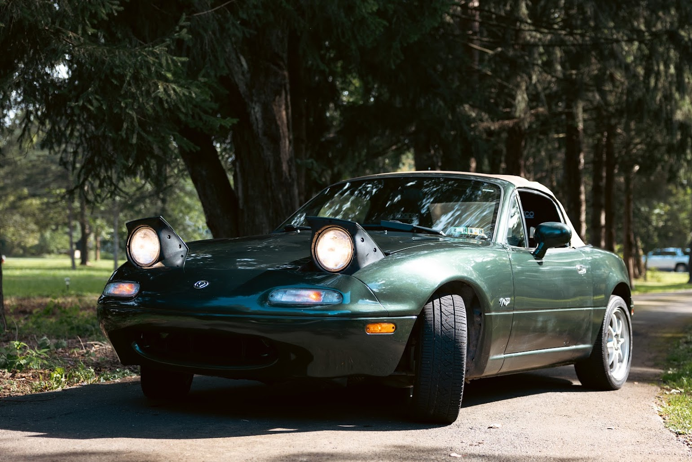

# Vehicle info
+ vin: `JM1NA3536V0729022`
+ license: `TODO`
+ purchased Thursday 9/10/23 for $8,750 @ 112,900 miles
+ 1997 m-edition

# Hard top 4-25

# [Suspension and Tires 6-24](Autocross2024.md)
- V-Maxxx coilovers, sway bars, and adjustable endlinks
- Toyo proxes

# [Glass 10-23](windshield-repair.md)
+ windshield chip repair
+ window bushings
+ fuel filter
+ oil change

# [Interior 9-23](updating-the-interior.md)
- steering wheel
- racing seats
- shifter rebuild

# [Inital maintainance 113k 9-23](taking-stock-of-our-purchase.md)
+ spark plugs & coils
+ borla exhaust
+ diff and trans

# Outstanding Problems
+ Hood Squeeky
+ Exhaust Rattle
+ Loose Endlink
+ Check Drains
+ Hard Top
+ Drift Tires