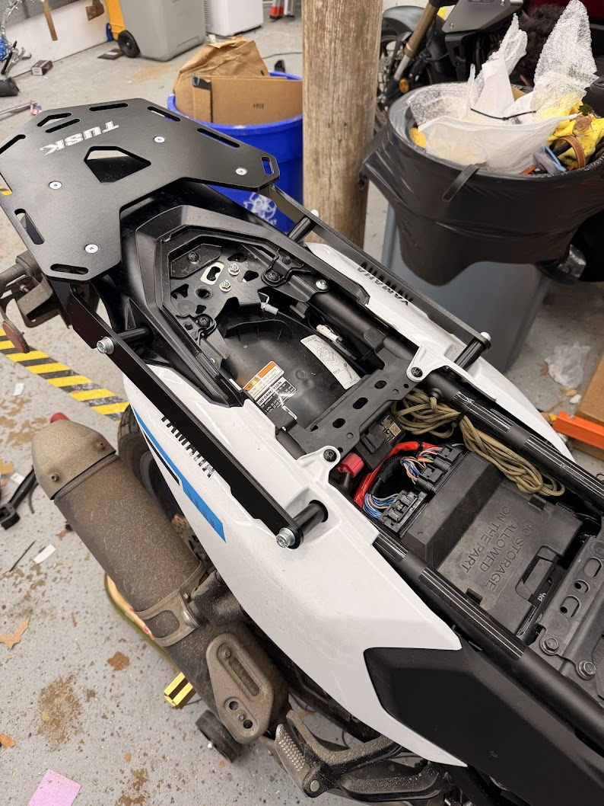
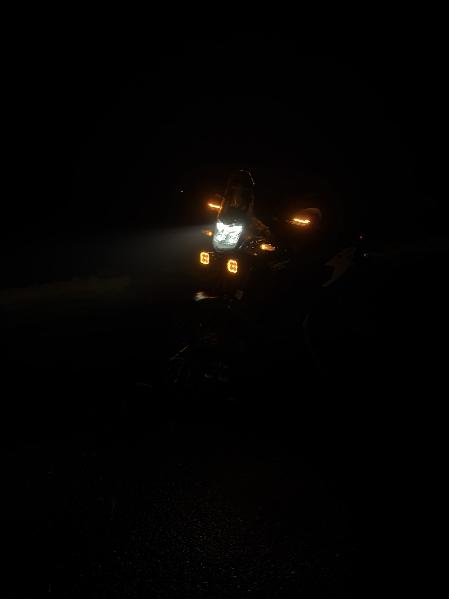
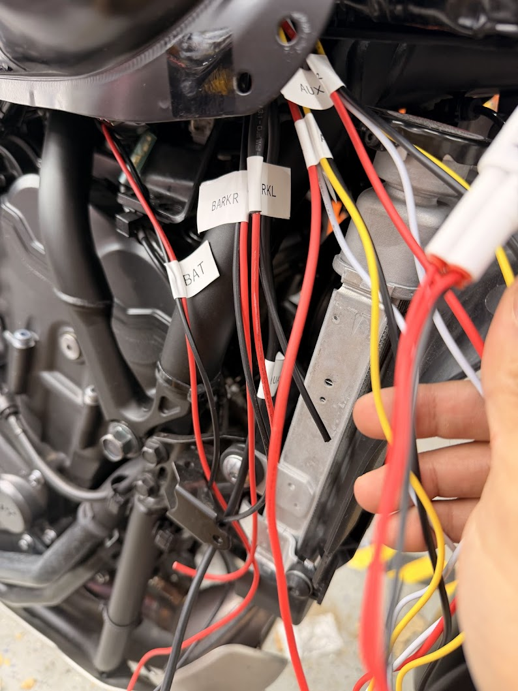
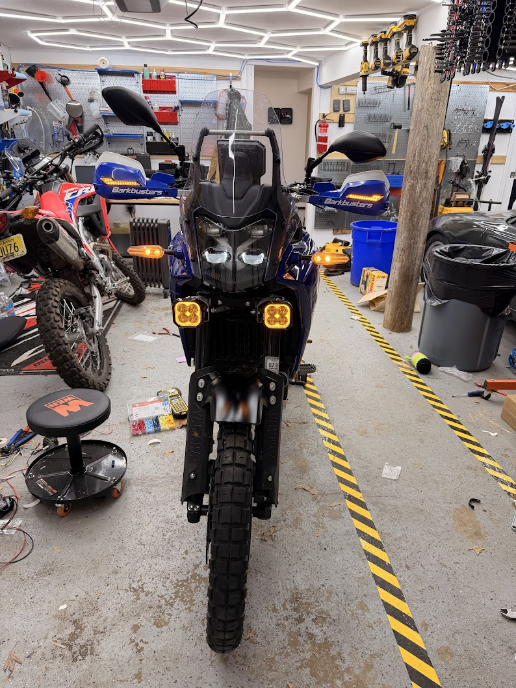
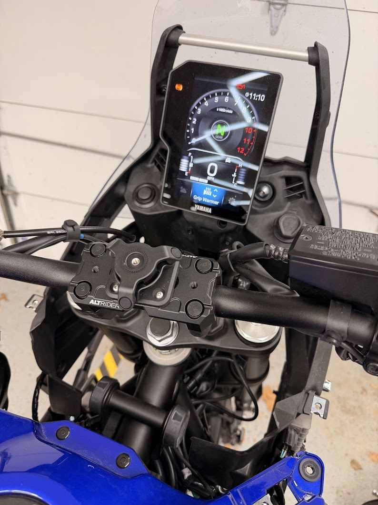
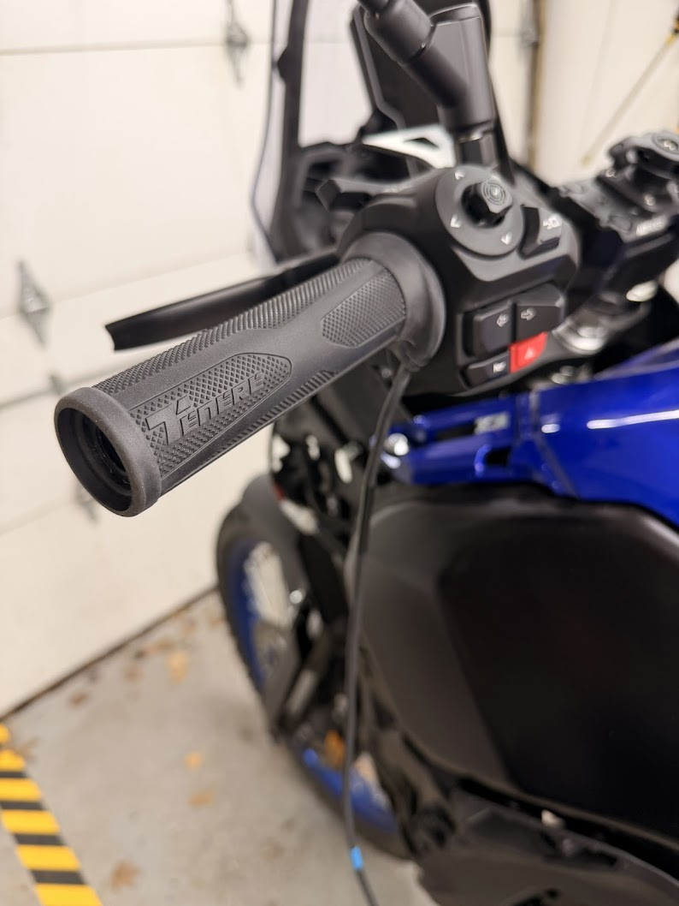
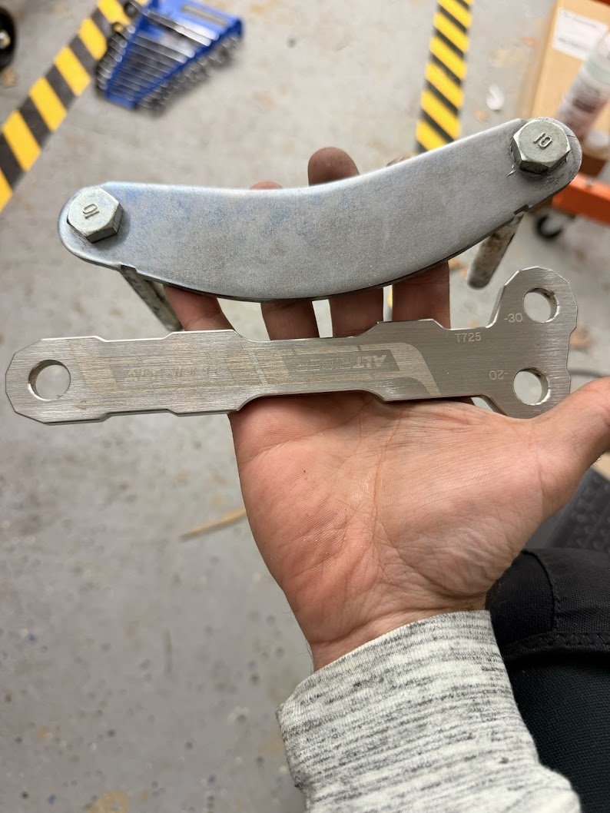

# 3-5-26 Luggage & Mirrors **2000 miles**
I installed the tusk luggage top rack, and it's great. I'm able to use carabiners to clip in my tusk duffel bag and backpack. Riding with nothing on my back is a great feeling.

I also installed double take mirrors because every time I dropped the mirror would turn and loosen itself. It was also super annoying to try to get a wrench past the brake reservoir, the double take mirrors have a big allan bolt up top. Install was very pleasant, mirrors are vastly more effective, and the ball mounts are pretty useful.

I also stowed some rope in case of emergency. I think a small block and tackle would also be a great addition for drops in weird situations that I can't manage myself.

# 3-5-26 Lighting, Handguards, Levers
For lighting I wanted a a rich amber pattern as DRLs, and then a powerful set of yellow lights synced to my high beam switch.

All the wires were routed to the right side. All the DRLs and the Quad Lock are on the accessory circuit. The high beam circuit is on it's own relay, ground triggered by the headlight wire.

The hand guards were upgraded from the stock plastic ones which failed to protect the clutch lever to barkbusters. I chose the blue barkbuster VPS plastic guards, I considered the more serious storm breakers as well as the cooler looking jets.

I installed the [barkbuster leds](https://www.revzilla.com/motorcycle/barkbusters-led-indicator-lights-for-jet-storm-vps-plastic-handguards?srsltid=AfmBOop-m871180YxxYWZcPFzgZt2MoJc182NWk_Q-RuFhjIkoBs6LRa&sku_id=1083064) and they were wired up to the aforementioned DRL circuit.

To replace the broken clutch lever I installed adjustable and "unbreakable" levers from ASV. I chose the full length levers so I would have mechanical advantage should I need it. Still working on dialing in the lever feel.

The ASV levers are incompatible with the barkbusters but I used the spacers that I had lying around. I think they were potentially the spacers that were originally on the bike, they're about 20mm, another redditor did similarly, and it worked fine. On net I do think both mods are worthwhile with the workaround in place.

Unwisely, I used the original screws, through the spacer and not enough threads were threaded. At some point in a drop I tried to pick up the bike by pulling up on the handguard and I ended up ripping the handguard out. I ordered longer screws, guessed on length and had to cut them to size, but once the screws were replaced the fit is very good and I have since dropped the bike 3 times and was able to lift it by the hand guard.

# 2-12-26 Quad Lock
Purchased the altrider handlebar mount which gave me the AMPs hole spacing standard on top of which I mounted the quad lock vibration dampener, on top of which I mounted the quad lock wireless charger. I opted for the version that hard wires 12V rather then the one that operates via a usb c converter. It's much more compact and fewer parts that may or may not work correctly. Wiring will be discussed in the headlight entry above.

# 2-12-26 OEM heated grips
OEM heated grips installed: . These are incredibly effective, the hottest setting is often too hot for me. Easy to control and tune in the dash.

# 2-11-26 suspension
Stock ground clearance: 9.4in
Initial front fork clearance 7.4mm
New front fork position ~17.5mm
Rear link set to -20mm position

went from not being able to touch both feet on the ground at the same time, to being able to just barely tip toe. I was pretty unsure about this change but as soon as I got in the real world it felt right.

# 1-23-26 **1700 miles**
Picked up from Logan Davis from a storage location in Saratoga Springs. Battery a litle low on pickup, and there's damage on the headlights. Apart from that it's in great condition. Pretty surprised I was able to grab this 25 version with new suspension and throttle tech for $8500 (kinda). 

[pasted_image_2026-01-27_03-48-10.png](imports/pasted_image_2026-01-27_03-48-10.png)

Am in search for most of the fun the CRF has given me, and also more comfort on the highway. 

VIN: `JYADM17E3SA002055`

Originally purchased by Logan Davis, for $13,108.18 at GT-Toys. There was a Lien on the title, and also a lien release from Community Bank. Origially DMV said it needed to be notarized, but dmv's site and a revisit prooved that to not be needed. There is a Lifetime Engine Limited Warranty by from "GT Toyz", their stock number is `Y25MC141`. On this page the vehicle price seems to be $15,552.60, perhaps this was what this was initially listed at. There is also a factory waranty that expires in 7/26/26.

# todo-now
* [x] ~~register~~
* [x] ~~[heated grips](https://yamaha-motor.com/p/tenere-700-heated-grip?srsltid=AfmBOorOxA5xfGyR-h57z6CfUtobh8K6ox1Ax5mtp6N8OuBMFzrOtYbY)~~
* [x] ~~[Clutch](https://www.motodracing.com/asv-yamaha-tenere-700-levers-f3-style-shorty?setCurrencyId=1&sku=ASV-BRF340S+CRF340S-D&gad_source=1&gad_campaignid=20596204294&gclid=Cj0KCQiAyvHLBhDlARIsAHxl6xril7UlYh9DwNeSgqk3Qvt58jHzX7Hv2CrkBrKPwnVbgow307eitIoaAhQLEALw_wcB)~~
* [x] ~~quad lock, maybe with [this thing](https://www.revzilla.com/motorcycle/altrider-top-clamp-system-with-amps-yamaha-tenere-700-2021-2025?sku_id=10557004&utm_source=google&utm_medium=cpc&utm_campaign=PLA-Metric%20Parts-PMAX&utm_term=go_cmp-20958281733_adg-_ad-__dev-c_ext-_prd-10557004_mca-2934692_sig-Cj0KCQiAvtzLBhCPARIsALwhxdolWfXG6ZJLXAN2k1Tf_yyA46S6sT1pNmbNBqmcBSa3CBX-8ssQ7zAaAuNwEALw_wcB&gad_source=1&gad_campaignid=20968028560&gbraid=0AAAAAD8sxezdmhMoLWG0r9kZkKeakH01u&gclid=Cj0KCQiAvtzLBhCPARIsALwhxdolWfXG6ZJLXAN2k1Tf_yyA46S6sT1pNmbNBqmcBSa3CBX-8ssQ7zAaAuNwEALw_wcB). Or [this thing](https://www.motomachines.com/evotech-performance-quad-lock-handlebar-mount-yamaha-tenere-rally-2019?utm_source=google&utm_medium=cpc&utm_campaign=18270211356&utm_content=&utm_term=&gad_source=1&gad_campaignid=18270217104&gbraid=0AAAAADuddyhb3eU9yOngf5w_cMXQkIvYA&gclid=Cj0KCQiAvtzLBhCPARIsALwhxdr7tAZrs6K6-vZycoNKqsquDtsTd17V7WPze7R6lWJo4A8EmRLcFgYaAl1FEALw_wcB)~~
* [x] ~~hand guards~~
* [x] oil change
  * [ ] need to check oil type
  * [ ] filter arrival
* [x] ~~spools~~
  * [x] ~~arrived~~
* [x] quickshifter
* [x] ~~lighting~~
  * [x] ~~The lights have arrived~~
  * [x] ~~Bracket arive~~

Screws
tire pressure

# todo-later
* [ ] crash bars? maybe not plastics are $300, everything else looks resiliant.
* [ ] extra wheels for knobies?
* [ ] rear lighting, maybe [on the license plate](https://denalielectronics.com/products/dnl-b6-10100?variant=43252575797432&country=US&currency=USD&utm_medium=product_sync&utm_source=google&utm_content=sag_organic&utm_campaign=sag_organic&tw_source=google&tw_adid=&tw_campaign=23401923798&tw_kwdid=&gad_source=1&gad_campaignid=23411341573&gbraid=0AAAAACzv8pUduC-1sn1yKxXDqUWs6oLJC&gclid=Cj0KCQiA7fbLBhDJARIsAOAqhsee961YM4TyYIIce1ZgQ4Pd8SXJyCE67iYka4OOvo0iTSY3sS2dKRkaArU9EALw_wcB), or upgrade [the blinkers](https://www.cyclopsadventuresports.com/Tuff-Light-full-flex-Blinkers_p_437.html).
* [ ] [cruise control?](https://veridiancruise.com/knowledge-base/install-yamaha-tenere-700/?srsltid=AfmBOorCjgKm94agg6dP6cfFsDLDI-sM65VlJfzGq2uLXGo35wjnPZbE)

# todo much later
* [ ] [plastics](https://www.tmbrmoto.com/collections/rtech/products/rtech-revolution-plastic-body-kit-2025-yamaha-tenere-700?variant=47230584488101)

todo docs: document the coolant resevoir